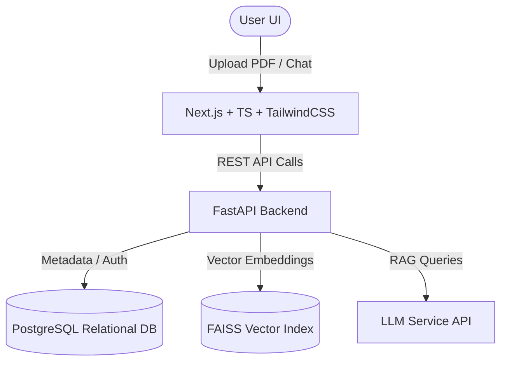

# AGENT_GUIDE.md - AI Agent Execution Blueprint

This document contains structured instructions, constraints, and architecture mappings designed for AI coding agents collaborating on **LegalLens AI**.

---

<system_context>

## 1. Project Context
* **Name**: LegalLens AI
* **Concept**: RAG-based (Retrieval-Augmented Generation) legal document analysis platform.
* **Goal**: Help non-legal professionals (students, freelancers, new hires) understand contracts and spot risky clauses in under 5 minutes.
* **Core Principle**: **Evidence First**. Every AI-generated warning or answer must be anchored to a specific source paragraph or clause in the uploaded document.

</system_context>

---

<agent_objectives>

## 2. Core Objectives & Scope

### 2.1 The Agent MUST:
* [x] Parse PDF contracts and extract text accurately.
* [x] Segment document content into search indexable chunks.
* [x] Run vector search retrieval to collect context for QA prompts.
* [x] Detect potentially risky clauses using heuristic indicators and LLM analysis.
* [x] Translate complex legalese into plain language explanations.
* [x] Provide exact source references (citations) with matching highlighted spans.

### 2.2 The Agent MUST NOT:
* [ ] Provide official legal advice or legal certainty claims.
* [ ] Hallucinate or make statements unsupported by the document context.
* [ ] Store API keys or credentials directly in the codebase.
* [ ] Perform automatic database structural changes without documenting migrations.

</agent_objectives>

---

<technology_stack>

## 3. Architecture & Tech Stack



### 3.1 Component Specifications
| Layer | Technologies | Primary Responsibilities |
| :--- | :--- | :--- |
| **Frontend** | Next.js (Page router/App router), TypeScript, TailwindCSS | File upload states, contract text viewer, interactive risk dashboard, smooth-scrolling to highlighted citation spans, chat interface. |
| **Backend** | FastAPI, Python | Auth routes, PDF processing pipeline, embedding generation, FAISS index management, RAG prompt orchestration, risk analysis endpoints. |
| **Storage** | PostgreSQL, FAISS, Local Disk | PostgreSQL for user metadata, files metadata, and session history. FAISS for vector storage. Local storage for development file assets. |

</technology_stack>

---

<processing_pipeline>

## 4. Document Processing & RAG Specification

### 4.1 Document Pipeline Flow
```
[Upload PDF] ──> [Text Extraction] ──> [Cleaning & Normalization]
                                              │
[Retrieval (k=5)] <── [FAISS Index] <── [Embedding] <── [Chunking (500-1000 tokens)]
```

### 4.2 Pipeline Parameters
* **Chunk size**: 500 - 1000 tokens.
* **Chunk overlap**: 100 - 200 tokens.
* **Retrieval k**: Top 5 chunks.
* **Citation Metadata Schema**:
  ```json
  {
    "clause_id": "string",
    "section_title": "string",
    "excerpt": "string",
    "risk_severity": "HIGH | MEDIUM | LOW"
  }
  ```

</processing_pipeline>

---

<risk_detection_rules>

## 5. AI Risk Detection Heuristics

When scanning contracts, look for specific indicator clauses:

> [!WARNING]
> **HIGH RISK Indicators**:
> * Unilateral termination rights without prior notice.
> * Automatic contract renewal with penalty fees.
> * 100% deposit forfeiture on early termination.
> * Indemnity clauses that transfer all liabilities to the weaker party.

> [!NOTE]
> **MEDIUM / LOW RISK Indicators**:
> * Restrictive Non-compete covenants (geography too broad, duration > 1 year).
> * Unclear milestones or payment schedules without defined grace periods.
> * Mandatory arbitration clauses in unfavorable jurisdictions.

</risk_detection_rules>

---

<development_guidelines>

## 6. Coding & Execution Guidelines for AI Agents

### 6.1 Clean Code Standards
* **TypeScript**: Enforce strict type safety. Do not use `any`.
* **Python**: Always use type hints in FastAPI functions.
* **Readability**: Prefer explicit, self-documenting logic over complex optimizations. Keep functions under 100 lines.
* **Robustness**: Wrap API calls and parsing logic in try-catch/try-except blocks with clean error reporting.

### 6.2 Definition of Done (DoD)
1. Feature implementation matches the user story acceptance criteria.
2. Unit and integration tests pass successfully.
3. API documentation is updated and verified.
4. No secrets or API credentials are committed to Git.
5. All code changes are reviewed and merged via Pull Requests.

</development_guidelines>
