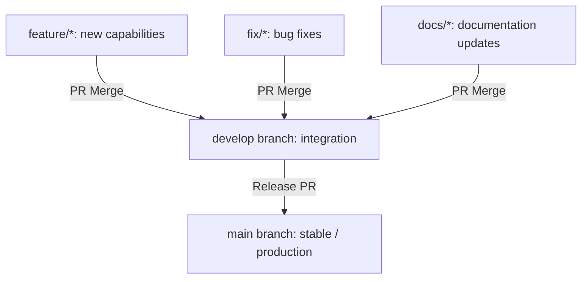

# AI_GIT_WORKFLOWS.md - AI & Developer Git Collaboration Protocol

This document defines the branching strategy, commit format conventions, and Pull Request verification rules required for AI agents and human contributors.

---

<git_architecture>

## 1. Branching Strategy Flow



### 1.1 Branch Naming Conventions
| Branch Category | Naming Pattern | Example |
| :--- | :--- | :--- |
| **Feature** | `feature/<feature-name>` | `feature/pdf-upload-endpoint` |
| **Bug Fix** | `fix/<bug-name>` | `fix/pdf-extractor-timeout` |
| **Documentation** | `docs/<doc-topic>` | `docs/rag-flowchart-update` |

> [!CAUTION]
> **Strict Policy**: Direct pushes to `main` and `develop` branches are forbidden. All code changes must go through a dedicated topic branch and a Pull Request.

</git_architecture>

---

<commit_formatting>

## 2. Commit Message Standards

All commits must adhere to the **Conventional Commits** specification.

### 2.1 Commit Structure
```
<type>: <description>

[optional body explaining details]
```

### 2.2 Allowed Commit Types
* **`feat`**: A new user feature (e.g. `feat: add pdf extraction worker thread`).
* **`fix`**: A bug fix (e.g. `fix: handle empty paragraphs in pdf parser`).
* **`docs`**: Documentation changes only (e.g. `docs: add setup instructions`).
* **`refactor`**: A code change that neither fixes a bug nor adds a feature.
* **`test`**: Adding missing tests or correcting existing tests.
* **`perf`**: A code change that improves performance.
* **`chore`**: Maintenance, build configs, or dependency updates.

### 2.3 Commit Quality Rules
* **Atomic Changes**: One logical change per commit. Avoid grouping unrelated fixes or refactoring inside a single commit.
* **Terse Summaries**: Keep the description under 50 characters, starting with a lowercase verb.

</commit_formatting>

---

<pr_validation>

## 3. Pull Request (PR) Requirements

Before submitting a Pull Request, the contributor (or AI agent) must ensure the following conditions are met:

### 3.1 Verification Checklist
* [x] **Local Build**: The application builds without errors (`npm run build` or `fastapi build` equivalent).
* [x] **Unit Testing**: All unit tests run and pass locally.
* [x] **No Secrets**: Check diff to ensure no local API keys or config parameters are committed.
* [x] **Documentation**: If public APIs or environment variables changed, update corresponding docs.

### 3.2 PR Description Template
```markdown
## Purpose
[State the goal and what this PR accomplishes]

## Key Changes
- [File A](file:///path/to/A): [Summary of change]
- [File B](file:///path/to/B): [Summary of change]

## Verification & Testing
- Command run: [Test command]
- Results output: [Snippet or logs showing success]
```

</pr_validation>
