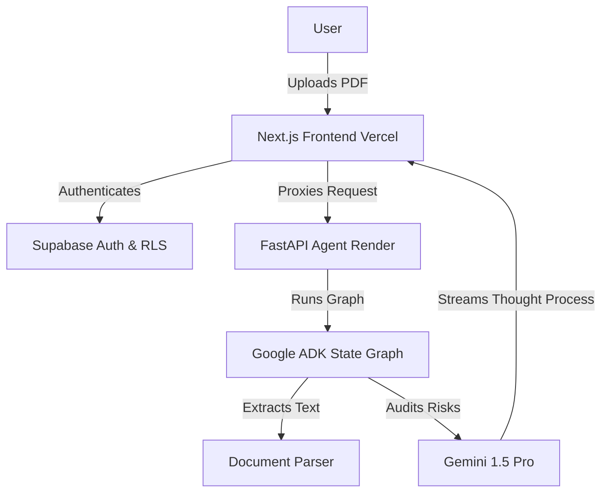

<div align="center">
  
  
  
  
</div>

<br />

<div align="center">
  <h1>⚖️ LegalLens AI</h1>
  <p><strong>Your Autonomous AI Legal Operator</strong></p>
  <p><i>Democratizing contract review through Agentic Workflows and Zero-Hallucination Guardrails.</i></p>
</div>

---

## 📖 Overview

**LegalLens AI** is an intelligent, autonomous agent designed to solve a ubiquitous problem: **understanding dense legal contracts**. 
Most people sign rental agreements, NDAs, and employment contracts without fully understanding the legalese, exposing themselves to hidden penalties, predatory deposit forfeiture, and auto-renewals.

Built as a capstone project for the **Kaggle AI Agents Intensive Vibe Coding**, LegalLens AI acts as an expert legal auditor. Users simply upload a contract (PDF), and our Agent instantly flags high-risk clauses, translates them into plain language, and provides 100% verified citations directly from the source document.

*This project is submitted under the **Agents for Good** & **Agents for Business** tracks.*

---

## 🌟 Key Features & Capstone Highlights

LegalLens AI was architected from the ground up to meet and exceed all 5 Google Codelabs criteria:

1. **Custom Antigravity Skills (Codelab 1):** Infused with expert legal heuristics (`SKILL.md`) to systematically categorize risks (Deposits, Non-Competes, Terminations) and score severities.
2. **Advanced ADK Lifecycle (Codelab 2):** Powered by the Google GenAI SDK and a State Graph architecture (`AnalyzeNode` -> `VerifyNode`) to ensure high accuracy and multi-step reasoning.
3. **Secure Agentic Coding (Codelab 3):** 
   - **Data Privacy First:** Row Level Security (RLS) guarantees absolute data isolation.
   - **Auto-Destruct Protocol:** A `pg_cron` background job auto-deletes contracts from the server after 24 hours.
   - **Prompt Injection Defense:** Hardened system instructions (`CONTEXT.md`) backed by CI/CD Pytest security checks.
4. **Vibecode Frontend (Codelab 5):** An event-driven, Next.js frontend featuring **Real-time Thought Streaming** (SSE). Users can watch the AI "think" step-by-step before arriving at a conclusion.
5. **Modern Cloud Deployment (Codelab 4):** A decoupled monorepo architecture: the Frontend lives on Vercel, the Python ADK backend runs on Render, and the database runs on Supabase.

---

## 🏗️ Architecture



---

## 🚀 Quick Start (Local Development)

### Prerequisites
- Node.js >= 18
- Python >= 3.11
- `uv` package manager

### 1. Frontend Setup
```bash
# Install dependencies
npm install

# Setup environment variables
cp .env.example .env.local
# Add NEXT_PUBLIC_SUPABASE_URL and NEXT_PUBLIC_SUPABASE_ANON_KEY

# Run development server
npm run dev
```

### 2. Backend Agent Setup
```bash
cd agent/contract_auditor_agent

# Install Python dependencies using uv
uv sync --all-extras --dev

# Add your Gemini API Key
export GEMINI_API_KEY="your_api_key_here"

# Run the FastAPI server locally
uv run uvicorn server:app --reload --port 8000
```

---

## 🌐 Deployment
For instructions on deploying the AI Agent via Docker to Render and the Next.js app to Vercel, please refer to our [Deployment Guide](./docs/DEPLOYMENT_GUIDE.md).

---

## ⚠️ Disclaimer
**LegalLens AI provides informational assistance only.** It does not provide legal advice, nor does it create an attorney-client relationship. Always consult a licensed legal professional before signing any legally binding documents.

---

<div align="center">
  <i>Built with ❤️ using the Vibe Coding Philosophy.</i>
</div>
