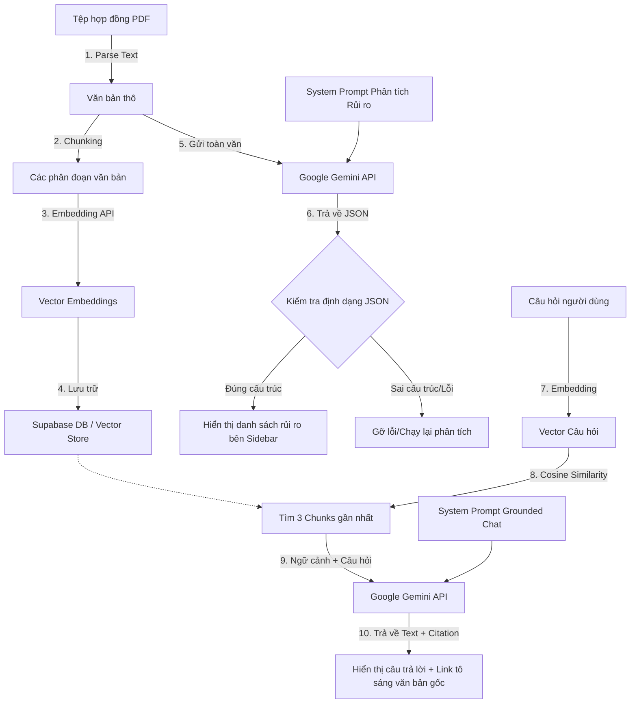

# THIẾT KẾ TÍNH NĂNG AI (AI FEATURE DESIGN) - LEGALLENS AI

Tài liệu này chi tiết hóa thiết kế kỹ thuật cho hai tính năng tích hợp AI cốt lõi trong **LegalLens AI**:
1. **Phân tích Rủi ro Hợp đồng tự động** (US-05 & US-06)
2. **Trợ lý Hỏi đáp Grounded Chatbot** (Q&A)

---

## 1. Tổng quan Tính năng AI (AI Feature Design)

### 1.1 Tên Tính năng (Feature Name)
**AI Contract Risk Analyzer & Grounded Q&A Assistant** (Trợ lý AI Phân tích Rủi ro & Hỏi đáp Hợp đồng đối chiếu nguồn).

### 1.2 Giá trị phía Người dùng (User Value)
Giúp người dùng phổ thông (sinh viên đi thuê nhà, người làm việc tự do, nhân viên mới) nhanh chóng thấu hiểu các điều khoản bất lợi, không rõ ràng hoặc mang tính phạt đền bù trong hợp đồng gốc chỉ trong vài giây, đồng thời cho phép họ đặt câu hỏi tự do để làm rõ nghĩa vụ mà không cần kiến thức chuyên sâu về luật.

### 1.3 Dữ liệu Đầu vào (Input)
* **Phân tích rủi ro:** Toàn bộ văn bản thô trích xuất từ file PDF hợp đồng.
* **Hỏi đáp Q&A:** Nội dung câu hỏi từ người dùng và 3 phân đoạn văn bản hợp đồng liên quan nhất (Context chunks) được lấy ra từ Vector Store.

### 1.4 Kết quả Đầu ra (Output)
* **Với phân tích rủi ro:** Danh sách các rủi ro được định dạng dưới dạng JSON có cấu trúc chặt chẽ:
  * Phân loại mức độ: `HIGH`, `MEDIUM`, `LOW`.
  * Danh mục rủi ro: `Deposit` (Đặt cọc), `Termination` (Chấm dứt), `Penalty` (Phạt vi phạm), `Non-Compete` (NDA/Hạn chế cạnh tranh), `Other`.
  * Giải thích bình dân: Chuyển đổi ngôn từ pháp lý phức tạp sang câu hỏi/câu trả lời dễ hiểu cho người dùng.
  * Đoạn trích dẫn gốc (`excerpt`): Dòng text chính xác trong hợp đồng để đối chiếu.
  * Chỉ số vị trí (`location`): Trang hoặc từ khóa định vị.
* **Với Hỏi đáp Q&A:** Phản hồi bằng ngôn ngữ tự nhiên được "grounded" (chỉ lấy thông tin từ tài liệu), đi kèm với các thẻ dẫn chứng (ví dụ: `[Điều 4.2]`).

---

## 2. Luồng Xử lý Dữ liệu AI (AI Feature Flow)

Dưới đây là sơ đồ chi tiết quy trình xử lý từ lúc tải hợp đồng lên đến lúc hiển thị phân tích AI:



---

## 3. Cấu hình Prompt Hệ thống (System Prompts & Structured Outputs)

Để đảm bảo tính nhất quán và ngăn chặn mô hình AI trả về văn bản tự do, chúng ta cấu hình các System Prompts chuyên biệt:

### 3.1 Prompt Phân tích Rủi ro (Risk Analysis System Prompt)
```text
Bạn là một chuyên gia pháp lý và là Trợ lý phân tích hợp đồng thông minh. Nhiệm vụ của bạn là đọc kỹ văn bản hợp đồng dưới đây và phát hiện ra các rủi ro hoặc điều khoản bất lợi tiềm ẩn cho người dùng phổ thông.

Hãy phân tích dựa trên các danh mục rủi ro:
1. Đặt cọc (Deposit): Các điều kiện phạt mất cọc quá khắt khe, không hoàn cọc.
2. Chấm dứt (Termination): Quyền đơn phương chấm dứt hợp đồng bất bình đẳng, thời gian báo trước quá ngắn.
3. Phạt vi phạm (Penalty): Các khoản phạt tiền đền bù quá mức hợp lý.
4. Hạn chế cạnh tranh/Bảo mật (NDA/Non-Compete): Thời gian cấm làm việc quá dài, phạm vi địa lý quá rộng đối với nhân viên.
5. Khác (Other): Các điều khoản tự động gia hạn, tăng phí không báo trước.

Yêu cầu bắt buộc về cấu trúc đầu ra (JSON array):
[
  {
    "category": "Deposit" | "Termination" | "Penalty" | "Non-Compete" | "Other",
    "severity": "HIGH" | "MEDIUM" | "LOW",
    "explanation": "[Giải thích ngắn gọn bằng ngôn ngữ dân dã, dễ hiểu, tập trung vào tác động trực tiếp tới người dùng]",
    "excerpt": "[Trích dẫn CHÍNH XÁC dòng chữ chứa điều khoản này trong hợp đồng gốc, không được chỉnh sửa một từ nào]",
    "location": {
      "clause_number": "[Tên Điều/Khoản, ví dụ: Điều 5.2]"
    }
  }
]

Không viết bất kỳ văn bản dẫn nhập hoặc kết luận nào ngoài JSON. Nếu không phát hiện rủi ro, hãy trả về một mảng rỗng [].

HỢP ĐỒNG PHÂN TÍCH:
{contract_text}
```

### 3.2 Prompt Trợ lý Hỏi đáp (Grounded Chatbot System Prompt)
```text
Bạn là một trợ lý AI thông minh có nhiệm vụ trả lời các câu hỏi của người dùng dựa TRÊN NGỮ CẢNH ĐƯỢC CUNG CẤP dưới đây.

Ngữ cảnh được trích xuất từ hợp đồng cá nhân của người dùng. Hãy tuân thủ nghiêm ngặt các nguyên tắc sau:
1. Chỉ trả lời dựa vào thông tin có trong phần NGỮ CẢNH.
2. Nếu câu hỏi không thể trả lời bằng thông tin trong NGỮ CẢNH, hãy lịch sự trả lời: "Tôi xin lỗi, thông tin này không được đề cập trong hợp đồng gốc. Vui lòng kiểm tra lại tài liệu." Không tự ý bịa đặt thông tin.
3. Luôn đính kèm tên Điều/Khoản nguồn làm trích dẫn trong ngoặc vuông ở cuối câu trả lời (ví dụ: "...bạn sẽ bị mất cọc [Điều 4.2]").
4. Giọng điệu khách quan, trung thực, hỗ trợ. Tuyệt đối không đưa ra lời khuyên pháp lý chính thức. Nhắc nhở người dùng tham khảo luật sư nếu câu hỏi phức tạp.

NGỮ CẢNH HỢP ĐỒNG:
{context_chunks}

CÂU HỎI NGƯỜI DÙNG:
{user_question}
```

---

## 4. Quản lý Rủi ro AI & Phương án Giảm thiểu (Risks & Mitigation)

| Tên Rủi ro | Mô tả chi tiết | Tác động | Giải pháp Giảm thiểu (Mitigation Strategies) |
| :--- | :--- | :---: | :--- |
| **Bảo mật Dữ liệu (Privacy Risks)** | Hợp đồng cá nhân chứa các thông tin nhạy cảm của người dùng (Tên, số CCCD, địa chỉ nhà, mức lương). | Cao | 1. Không lưu trữ tệp tin PDF trên local server lâu dài; tải trực tiếp lên bucket bảo mật của Supabase Storage với chính sách RLS chặt chẽ.<br>2. Sử dụng API Gemini qua cổng bảo mật của tổ chức, cam kết không sử dụng dữ liệu hội thoại để huấn luyện mô hình (API data privacy policy).<br>3. Ở client-side, hiển thị rõ cảnh báo khuyên người dùng che/bôi mờ (redact) thông tin nhạy cảm trước khi tải lên nếu cần thiết. |
| **Ảo tưởng AI (Hallucination)** | AI tự vẽ ra rủi ro không có trong hợp đồng, hoặc trích dẫn sai lệch đoạn văn bản gốc. | Cao | 1. Bắt buộc AI trả về chuỗi trích dẫn gốc (`excerpt`) trùng khớp 100% với ký tự trong hợp đồng.<br>2. Client-side so khớp chuỗi trích dẫn gốc này với nội dung lưu trong DB; nếu không trùng khớp, hệ thống sẽ ẩn hoặc cảnh báo tính xác thực của thẻ rủi ro đó.<br>3. Bắt buộc thiết kế tính năng cuộn và tô sáng văn bản gốc: khi nhấn vào rủi ro, người dùng được dẫn trực tiếp đến vị trí gốc để đối chiếu bằng mắt thường. |
| **Ỷ lại vào AI (Over-trust)** | Người dùng coi câu trả lời của AI là lời khuyên pháp lý tuyệt đối và không tự đọc lại các điều khoản quan trọng. | Trung bình | 1. Đặt thông báo Miễn trừ trách nhiệm (Disclaimer) rõ ràng ở chân trang tải lên và Sidebar phân tích.<br>2. Nhãn dán `"Do AI phân tích"` được gán nổi bật cạnh mọi phản hồi.<br>3. Thiết kế nút "Tải lại / Phân tích thủ công" cho phép người dùng tự chỉnh sửa, ghi chú hoặc xóa bỏ các cảnh báo rủi ro do AI phát hiện. |

---

## 5. Quyền Kiểm soát của Con người (Human-in-the-loop)

Hệ thống LegalLens AI tuân thủ nghiêm ngặt nguyên tắc **AI hỗ trợ, Con người quyết định**:
* **Chỉnh sửa / Xóa thẻ rủi ro:** Người dùng có quyền nhấp vào biểu tượng chỉnh sửa trên thẻ rủi ro để cập nhật lại mô tả hoặc nhấn xóa bỏ nếu thấy AI phân tích sai (false positive).
* **Ghi chú cá nhân:** Người dùng có thể thêm ghi chú viết tay bên cạnh các đoạn văn bản gốc đã được AI tô sáng, giúp lưu giữ ý kiến riêng phục vụ đàm phán hợp đồng.
* **Xác nhận thủ công:** Hệ thống không tự động đưa ra bất kỳ quyết định thay đổi hay đề xuất ký kết hợp đồng nào mà không có sự kiểm tra và đồng ý thủ công từ người dùng.
