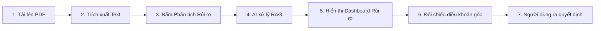

# ĐỀ XUẤT TÍNH NĂNG AI — TRÌNH PHÂN TÍCH RỦI RO HỢP ĐỒNG

---

## Chiến lược tích hợp AI (AI Strategy)

**LegalLens AI** là nền tảng hỗ trợ đọc hiểu hợp đồng thông minh. Bản chất sản phẩm vẫn hoạt động bình thường như một trình xem và duyệt tài liệu kể cả khi tính năng AI bị vô hiệu hóa.

* Trí tuệ nhân tạo (AI) đóng vai trò là **tính năng hỗ trợ tăng tốc**, giúp người dùng phát hiện nhanh các điều khoản bất lợi.
* Hệ thống **không đưa ra quyết định pháp lý** và không thay thế vai trò tư vấn chuyên nghiệp của luật sư.

---

## Tính năng AI chính: Trình Phân Tích Rủi Ro (AI Risk Analyzer)

### Mục tiêu
Tự động quét văn bản hợp đồng được tải lên và nhận diện các điều khoản tiềm ẩn rủi ro về mặt **tài chính (financial)**, **hợp đồng (contractual)**, hoặc **quyền riêng tư (privacy)**.

---

### Luồng tương tác của Người dùng (User Flow)



---

### Dữ liệu Đầu vào (Input) & Đầu ra (Output)
* **Input:** Văn bản hợp đồng thô đã trích xuất từ tệp PDF.
* **Output:** Danh sách các thẻ rủi ro phát hiện chứa thông tin:
  * **Danh mục rủi ro:** Tài chính, Hợp đồng, Quyền riêng tư.
  * **Mức độ nghiêm trọng:** Cao (High), Trung bình (Medium), Thấp (Low).
  * **Giải thích:** Giải nghĩa điều khoản bằng ngôn ngữ phổ thông dễ hiểu.
  * **Trích dẫn nguồn:** Chỉ ra số hiệu Điều/Khoản trong văn bản gốc làm căn cứ.

---

### Phân loại Danh mục Rủi ro Đánh giá

```
                                  RISK CATEGORIES
                                         |
         +-------------------------------+-------------------------------+
         |                               |                               |
         v                               v                               v
 [ Rủi ro Tài chính ]            [ Rủi ro Hợp đồng ]           [ Rủi ro Quyền riêng tư ]
  - Mất tiền đặt cọc              - Tự động gia hạn             - Cho phép chia sẻ dữ liệu
  - Phạt chậm thanh toán          - Nghĩa vụ ràng buộc quá mức  - Thu thập thông tin cá nhân
  - Phí chấm dứt hợp đồng sớm     - Cam kết cam kết quá dài     - Tiết lộ thông tin bên thứ 3
```

---

## Kiểm soát của Con người & An toàn (Human-in-the-loop)

> [!IMPORTANT]
> **Nguyên tắc cốt lõi:** Người dùng luôn giữ quyền kiểm soát tối cao đối với tài liệu của mình. Hệ thống được thiết kế để hỗ trợ thông tin tham khảo, không tự động đưa ra các quyết định thay thế con người.

* **Minh bạch thông tin:** Hệ thống hiển thị song song văn bản gốc của hợp đồng để người dùng có thể tự đối chiếu và đánh giá độc lập.
* **Đánh dấu rõ ràng:** Mọi kết quả phân tích do AI đưa ra đều được dán nhãn hiển thị là "AI-Generated" (Do AI tạo ra) để người dùng đề cao sự cảnh giác.
* **Quyền từ chối:** Người dùng có quyền bỏ qua, chỉnh sửa hoặc bác bỏ các kết quả phân tích của AI.

---

## Rủi ro của Tính năng AI & Biện pháp Giảm thiểu

> [!CAUTION]
> **Dương tính giả (False Positives):** AI cảnh báo rủi ro sai lệch trên các điều khoản hợp lý bình thường.
> **Âm tính giả (False Negatives):** AI bỏ sót các điều khoản rủi ro lớn trong hợp đồng dài.
> **Hallucination (Ảo tưởng):** AI tự suy diễn các giải thích hoặc các lỗi không tồn tại trong văn bản gốc.

### Biện pháp khắc phục:
* **Ứng dụng RAG chặt chẽ:** Chỉ cấp ngữ cảnh (context) từ văn bản hợp đồng đã được phân mảnh cho mô hình AI, giảm thiểu tối đa hiện tượng tự suy diễn tự do.
* **Bắt buộc hiển thị Citation (Trích dẫn):** Mọi cảnh báo rủi ro của AI đều bắt buộc phải đính kèm đoạn trích văn bản thực tế làm bằng chứng kiểm chứng.
* **Tuyên bố miễn trừ trách nhiệm pháp lý:** Đặt cảnh báo rõ ràng giúp người dùng nâng cao ý thức tự chịu trách nhiệm cho các quyết định ký kết cuối cùng của mình.

---

## Tiêu chí Đánh giá Thành công của Tính năng

* **Tính rõ ràng:** Người dùng phổ thông hiểu ngay ý nghĩa của giải thích rủi ro mà không cần dùng từ điển thuật ngữ pháp lý.
* **Tính liên kết:** 100% các rủi ro được cảnh báo đều liên kết dẫn tới chính xác vị trí tương ứng trong trình xem hợp đồng gốc.
* **Tính tùy chọn:** Giao diện trực quan cho phép người dùng ẩn/hiện hoặc bỏ qua các gợi ý rủi ro từ AI để tiếp tục đọc tài liệu bình thường.
