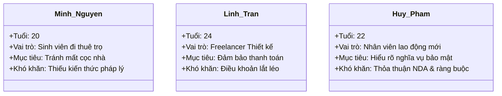
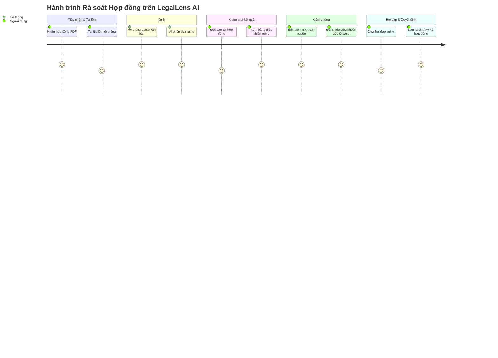

# ĐỐI TƯỢNG NGƯỜI DÙNG & HÀNH TRÌNH TRẢI NGHIỆM

---

## 1. Đối tượng Người dùng Giả định (User Personas)

Dự án LegalLens AI tập trung giải quyết bài toán đọc hiểu hợp đồng cho 3 nhóm đối tượng người dùng chính trong xã hội:

---

### Persona 1: Sinh viên đi thuê trọ (Minh Nguyễn)

> **"Mình chỉ muốn thuê một căn phòng trọ yên tĩnh để học tập, nhưng hợp đồng thuê nhà dài quá và có nhiều điều khoản phạt khó hiểu..."**

* **Thông tin cơ bản:** 20 tuổi, sinh viên trường Đại học Bách Khoa, đang tìm phòng trọ mới gần trường.
* **Mục tiêu:**
  * Đọc hiểu nhanh hợp đồng thuê phòng trọ trước khi đặt cọc tiền.
  * Nhận biết các điều khoản tịch thu tiền đặt cọc bất hợp lý.
  * Xác định rõ nghĩa vụ chi phí dịch vụ điện nước, sửa chữa thiết bị phòng trọ.
* **Khó khăn (Pain Points):**
  * Hoàn toàn không có chuyên môn luật, bối rối trước ngôn ngữ pháp lý phức tạp.
  * Hợp đồng viết tay hoặc in sẵn dài nhiều trang, dễ bỏ qua các điều khoản phạt ngầm.
  * Lo lắng bị chủ trọ chèn ép hoặc đơn phương tăng giá tiền phòng giữa kỳ hạn thuê.

---

### Persona 2: Freelancer làm việc tự do (Linh Trần)

> **"Ký hợp đồng dịch vụ với khách hàng mới luôn làm mình lo lắng. Mình sợ nhất là khách hàng chây ì thanh toán hoặc tự ý tăng thêm việc mà không trả thêm tiền..."**

* **Thông tin cơ bản:** 24 tuổi, nhà thiết kế đồ họa tự do (Freelance UI/UX Designer), thường xuyên làm việc trực tiếp với khách hàng cá nhân hoặc doanh nghiệp nhỏ.
* **Mục tiêu:**
  * Nắm chắc điều khoản quy định về thời gian bàn giao và tiến độ thanh toán (Milestones).
  * Phát hiện sớm các rủi ro liên quan tới bồi thường hợp đồng hoặc tranh chấp sở hữu trí tuệ sản phẩm thiết kế.
  * Giới hạn rõ ràng phạm vi công việc tránh tình trạng bị lạm dụng công sức (Scope creep).
* **Khó khăn (Pain Points):**
  * Khách hàng tự soạn thảo hợp đồng dịch vụ dài dòng, đưa vào các điều khoản phạt đền bù bất lợi cho Freelancer.
  * Không hiểu rõ các thuật ngữ sở hữu trí tuệ bản quyền thiết kế ghi trong hợp đồng.

---

### Persona 3: Nhân viên mới ra trường đi làm (Huy Phạm)

> **"Hợp đồng lao động đầu tiên trong đời của mình có đính kèm một thỏa thuận bảo mật NDA rất dài. Mình không chắc liệu nó có hạn chế quyền làm việc của mình sau này không..."**

* **Thông tin cơ bản:** 22 tuổi, vừa tốt nghiệp đại học, nhận được lời mời làm việc tại một công ty công nghệ.
* **Mục tiêu:**
  * Hiểu rõ quyền lợi bảo hiểm, thời giờ làm việc và chế độ nghỉ phép năm.
  * Làm rõ nghĩa vụ bảo mật thông tin (NDA) và các cam kết hạn chế cạnh tranh (non-compete) sau khi thôi việc.
  * Hiểu đúng trình tự và thủ tục chấm dứt hợp đồng lao động đúng pháp luật.
* **Khó khăn (Pain Points):**
  * Các cam kết phạt vi phạm bảo mật thông tin nội bộ của công ty có con số đền bù quá lớn khiến Huy lo lắng.
  * Điều khoản cấm làm việc cho đối thủ cạnh tranh sau khi nghỉ việc mập mờ, khó tự phân tích phạm vi ảnh hưởng pháp lý.

---

## 2. Luồng Hành trình Người dùng Cốt lõi (Primary User Journey)

Hành trình rà soát hợp đồng của người dùng được mô phỏng qua 5 giai đoạn chính tương ứng với các trạng thái tương tác trên hệ thống LegalLens AI:

### Mô tả chi tiết các giai đoạn hành trình:

| Giai đoạn | Hành động của Người dùng | Phản hồi của Hệ thống | Trải nghiệm mang lại |
| :--- | :--- | :--- | :--- |
| **1. Upload** | Tải tệp PDF hợp đồng lên trang chủ | Trích xuất text, hiển thị trạng thái xử lý 4 bước | Nhanh chóng, rõ ràng |
| **2. Review** | Xem tóm tắt và danh sách cảnh báo | Hiển thị bảng điều khiển rủi ro phân loại Cao/Trung bình/Thấp | Nắm bắt nhanh rủi ro trong 1 phút |
| **3. Verify** | Nhấp vào trích dẫn nguồn trên thẻ rủi ro | Cuộn văn bản và tô sáng điều khoản tương ứng | Tin tưởng vì có bằng chứng trực quan |
| **4. Chat QA** | Nhập câu hỏi thắc mắc vào khung chat | AI phản hồi có đính kèm link trích dẫn đối chứng | Giải tỏa nghi vấn tức thì |
| **5. Decide** | Tải báo cáo hoặc tắt ứng dụng | Lưu lịch sử phân tích tài liệu | Tự tin đàm phán hoặc đặt bút ký |
