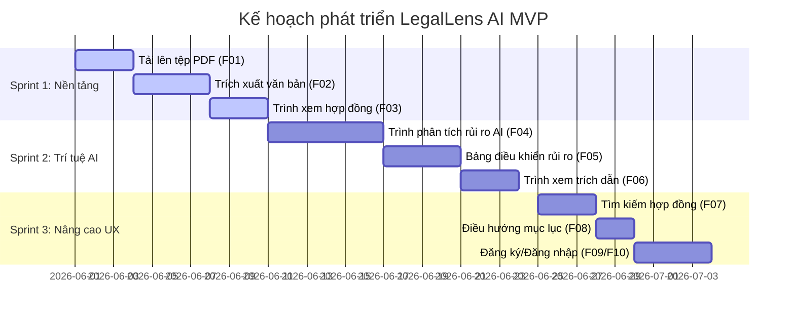

# DANH MỤC CÔNG VIỆC SẢN PHẨM (PRODUCT BACKLOG)

---

## Lộ trình Phát triển và Sprints (Roadmap Timeline)

Dự án phát triển LegalLens AI MVP tuân theo quy trình phát triển Agile/Scrum rút gọn trong vòng 3 Sprints tương ứng với lộ trình học tập:

---

## Bảng Danh mục Công việc Sản phẩm (Product Backlog Table)

Các tính năng được đánh giá độ phức tạp và nỗ lực triển khai dựa trên đơn vị **Story Points (SP)** (theo dãy Fibonacci: 1, 2, 3, 5, 8).

| ID | Tên tính năng | Phân loại | Độ ưu tiên | SP (Story Points) | Kế hoạch Sprint | Tích hợp AI |
| :--- | :--- | :--- | :---: | :---: | :--- | :---: |
| **F01** | Tải lên PDF | Quản lý Hợp đồng | **P1** (Must Have) | **3** | Sprint 1 (Tuần 6) | Không |
| **F02** | Trích xuất văn bản | Quản lý Hợp đồng | **P1** (Must Have) | **5** | Sprint 1 (Tuần 6) | Không |
| **F03** | Trình xem hợp đồng | Khám phá Hợp đồng | **P1** (Must Have) | **3** | Sprint 1 (Tuần 6) | Không |
| **F04** | Phân tích rủi ro AI | Phân tích rủi ro | **P1** (Must Have) | **8** | Sprint 2 (Tuần 7) | **Có** |
| **F05** | Bảng điều khiển rủi ro | Phân tích rủi ro | **P1** (Must Have) | **5** | Sprint 2 (Tuần 7) | Không |
| **F06** | Trình xem trích dẫn | Bằng chứng minh bạch | **P1** (Must Have) | **3** | Sprint 2 (Tuần 7) | **Có** |
| **F07** | Tìm kiếm hợp đồng | Khám phá Hợp đồng | **P2** (Should Have) | **3** | Sprint 3 (Tuần 8-9) | Không |
| **F08** | Điều hướng mục lục | Khám phá Hợp đồng | **P2** (Should Have) | **2** | Sprint 3 (Tuần 8-9) | Không |
| **F09** | Đăng ký tài khoản | Bảo mật người dùng | **P3** (Could Have) | **3** | Sprint 3 (Tuần 8-9) | Không |
| **F10** | Đăng nhập hệ thống | Bảo mật người dùng | **P3** (Could Have) | **3** | Sprint 3 (Tuần 8-9) | Không |

---

## Chi tiết Mục tiêu của các Sprints

### Sprint 1: Xây dựng Nền tảng Tài liệu (Document Foundation)
* **Mục tiêu chính:** Xây dựng luồng tải lên tài liệu thô hoạt động trơn tru. Người dùng có thể xem được nội dung hợp đồng sau khi tải lên.
* **Các tính năng bàn giao:** [F01] Tải lên PDF, [F02] Trích xuất văn bản thô, [F03] Trình xem hợp đồng thô.

### Sprint 2: Tích hợp Trí tuệ nhân tạo (AI Intelligence Sprint)
* **Mục tiêu chính:** Hiện thực hóa tính năng rà soát tự động. Giúp người dùng nhận diện rủi ro kèm theo bằng chứng kiểm chứng tại nguồn hợp đồng gốc.
* **Các tính năng bàn giao:** [F04] Trình Phân tích rủi ro AI (Gemini 2.5 Flash RAG), [F05] Bảng điều khiển rủi ro (dashboard hiển thị), [F06] Trình xem trích dẫn tô sáng văn bản gốc.

### Sprint 3: Tối ưu hóa & Quản lý Bảo mật (UX Enhancement & Security)
* **Mục tiêu chính:** Cải thiện khả năng khám phá tài liệu dài và chuẩn bị sẵn sàng hạ tầng tài khoản cá nhân.
* **Các tính năng bàn giao:** [F07] Tìm kiếm từ khóa, [F08] Điều hướng mục lục, [F09/F10] Module Đăng ký/Đăng nhập bảo mật tài khoản.

---

## Định nghĩa Hoàn thành (Definition of Done - DoD)

> [!IMPORTANT]
> Một hạng mục công việc (tính năng) được coi là hoàn thành hoàn toàn và sẵn sàng đưa lên môi trường thử nghiệm khi đáp ứng đầy đủ các tiêu chuẩn chất lượng sau:

1. **Về chức năng (Functional):** Code chạy đúng theo mô tả chi tiết của User Story và vượt qua các kịch bản kiểm thử (Acceptance Criteria).
2. **Kiểm duyệt mã nguồn (Code Review):** Mã nguồn được ít nhất 1 thành viên khác trong nhóm review chéo và phê duyệt pull request trên GitHub.
3. **Kiểm thử chất lượng (Testing):** Hoàn thành chạy kiểm thử chức năng tự động hoặc kiểm thử thủ công theo biên bản kiểm thử đã lập, không phát sinh lỗi nghiêm trọng (Blocker/Critical).
4. **Tài liệu hóa (Documentation):** Cập nhật đầy đủ hướng dẫn thiết lập cấu hình hoặc cập nhật hướng dẫn sử dụng trong tệp [README.md](file:///c:/Users/Admin/Documents/CODE_WORKSPACE/LegalLens_ZenAI/README.md) của dự án.
5. **Trình diễn thành công (Demo):** Tính năng được cấu hình chạy tốt trên môi trường local/staging và demo thành công trước GV hướng dẫn.
