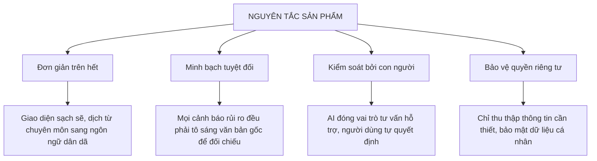
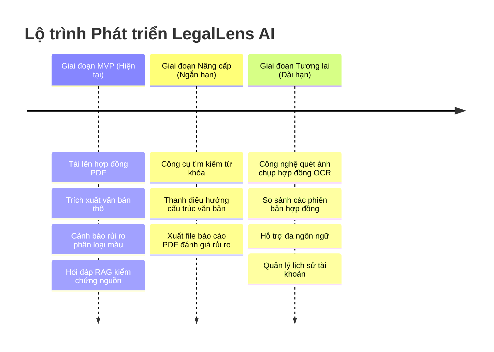

# TẦM NHÌN SẢN PHẨM — LEGALLENS AI

---

## Bản mô tả Tầm nhìn Moore (Moore Vision Charter)

> **[BẢN PHÁC THẢO ĐỊNH VỊ SẢN PHẨM]**
>
> * **DÀNH CHO:** Sinh viên, người lao động tự do (freelancers), nhân viên mới đi làm thường xuyên tiếp xúc với các hợp đồng dân sự và thương mại.
> * **NHỮNG NGƯỜI:** Gặp khó khăn trong việc hiểu thuật ngữ pháp lý phức tạp, dễ bỏ qua cạm bẫy tài chính và lo lắng trước khi đặt bút ký.
> * **SẢN PHẨM:** LegalLens AI là một nền tảng rà soát và phân tích hợp đồng thông minh được hỗ trợ bởi AI.
> * **GIÚP:** Đơn giản hóa ngôn ngữ pháp lý phức tạp, tự động nhận diện các điều khoản rủi ro tiềm ẩn (phạt, mất cọc, gia hạn ẩn) và cung cấp câu trả lời có bằng chứng đối chiếu trực tiếp.
> * **KHÁC BIỆT VỚI:** Cách đọc hợp đồng thủ công tốn thời gian, thuê luật sư đắt đỏ hoặc sử dụng các chatbot AI tự do không có trích dẫn nguồn kiểm chứng.
> * **SẢN PHẨM CỦA CHÚNG TÔI:** Cung cấp khả năng phân tích hợp đồng minh bạch, có thể giải thích được nhờ công nghệ Tạo tăng cường truy xuất (RAG), kết nối chặt chẽ kết quả phân tích của AI với văn bản gốc.

---

## Nguyên tắc Cốt lõi của Sản phẩm (Product Principles)

Sản phẩm LegalLens AI vận hành dựa trên 4 nguyên tắc cốt lõi:



---

## Phân tích Đối chiếu Giá trị mang lại (Value Proposition)

```
       +------------------------------------+------------------------------------+
       |       KHI CHƯA CÓ LEGALLENS        |       KHI CÓ LEGALLENS AI          |
       +------------------------------------+------------------------------------+
       | - Mất 1-2 tiếng tự đọc hợp đồng    | - Chỉ mất 5 phút nắm bắt toàn bộ   |
       | - Bỏ sót điều khoản phạt chấm dứt  | - AI tự động phát hiện rủi ro và   |
       |   sớm hoặc tự động gia hạn ẩn      |   cảnh báo trực quan theo màu sắc  |
       | - Mơ hồ về nghĩa vụ và quyền lợi   | - Trò chuyện trực tiếp với AI để   |
       |   pháp lý của bản thân             |   làm rõ nghĩa vụ bản thân         |
       | - Thiếu tin tưởng vào phân tích    | - Kiểm chứng dễ dàng nhờ liên kết  |
       |   do AI thông dụng tự do đưa ra    |   trực tiếp với dòng văn bản gốc   |
       +------------------------------------+------------------------------------+
```

---

## Lộ trình Mục tiêu MVP & Định hướng Tương lai

> [!NOTE]
> **Mục tiêu của phiên bản thử nghiệm MVP:** Giúp người dùng thực hiện trọn vẹn luồng tương tác: Tải lên -> Tóm tắt -> Cảnh báo rủi ro -> Hỏi đáp QA -> Đối chiếu trực tiếp điều khoản gốc.



---

## Những tính năng nằm ngoài phạm vi phát triển (Out of Scope)

Để duy trì tính tập trung và tuân thủ các quy định pháp luật hiện hành, LegalLens AI loại bỏ hoàn toàn các tính năng sau:
* **Tư vấn pháp lý thay thế luật sư:** Hệ thống không đưa ra lời khuyên pháp lý hoặc định hướng hành vi cụ thể cho người dùng.
* **Soạn thảo và Chỉnh sửa văn bản hợp đồng:** Không tham gia vào quá trình khởi tạo hay chỉnh sửa nội dung pháp lý.
* **Tự động đưa ra quyết định pháp lý:** Không tích hợp các chức năng tự động ký kết hoặc giải quyết tranh chấp thay con người.
