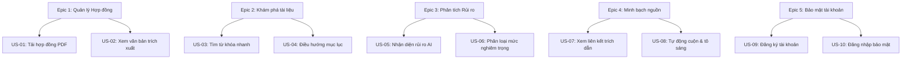

# YÊU CẦU DỰ ÁN & MÔ TẢ USER STORIES

---

## Bản đồ liên kết tính năng (Epics & User Stories Mapping)

Dưới đây là sơ đồ mô tả cách phân nhóm các Câu chuyện người dùng (User Stories) vào các Nhóm tính năng lớn (Epics):

---

## Các Kịch bản Sử dụng Thực tế (Use Case Scenarios)

### Kịch bản 1: Sinh viên thuê phòng trọ rà soát điều khoản đặt cọc
* **Tác nhân:** Minh Nguyễn (Sinh viên Bách Khoa).
* **Mục tiêu:** Kiểm tra xem điều kiện để nhận lại tiền đặt cọc có quá khắt khe hay chủ nhà có cài cắm điều khoản phạt chấm dứt hợp đồng sớm quá mức hợp lý không.
* **Hành trình:** Minh tải file scan hợp đồng thuê nhà PDF lên ứng dụng -> Bấm nút phân tích rủi ro -> AI báo có 2 rủi ro Cao (Điều khoản tịch thu 100% tiền đặt cọc khi chấm dứt sớm, phạt đền bù thêm 1 tháng tiền phòng) -> Minh bấm xem trích dẫn nguồn để kiểm chứng -> Hệ thống cuộn và tô sáng Điều 2.2 và Điều 8.4 -> Minh đàm phán lại với chủ nhà yêu cầu sửa đổi điều kiện báo trước 30 ngày để nhận lại cọc.

### Kịch bản 2: Freelancer kiểm tra điều khoản nghiệm thu & thanh toán
* **Tác nhân:** Linh Trần (Freelancer Designer).
* **Mục tiêu:** Xác định rõ thời hạn khách hàng phê duyệt sản phẩm thiết kế và quy trình giải ngân thanh toán sau khi hoàn tất các mốc tiến độ (milestones).
* **Hành trình:** Linh tải hợp đồng dịch vụ thiết kế lên -> Đọc tóm tắt và xem bảng điều khiển rủi ro -> AI phát hiện rủi ro Trung bình (Khách hàng có quyền đơn phương thay đổi tiến độ hoặc yêu cầu sửa đổi không giới hạn số lần) -> Linh trò chuyện với AI hỏi "Khách hàng trả tiền chậm phạt thế nào?" -> AI báo không tìm thấy điều khoản phạt trả chậm trong hợp đồng gốc -> Linh sửa đổi bổ sung điều khoản này vào hợp đồng trước khi ký.

---

## MÔ TẢ CHI TIẾT CÁC CÂU CHUYỆN NGƯỜI DÙNG (USER STORIES)

### Epic 1: Quản lý Hợp đồng (Contract Management)

#### US-01: Tải lên tài liệu hợp đồng
* **Mô tả:** Là một người dùng, tôi muốn dễ dàng kéo thả hoặc tải tệp PDF hợp đồng cá nhân lên hệ thống, để hệ thống xử lý nội dung văn bản.
* **Độ ưu tiên:** Cao (Must Have)
* **AI tham gia:** Không
* **Tiêu chuẩn nghiệm thu (Acceptance Criteria):**
  * **Given:** Người dùng ở trang chủ tải lên.
  * **When:** Chọn một tệp hợp đồng định dạng PDF hợp lệ (dung lượng dưới 10MB).
  * **Then:** Hệ thống tải tệp thành công và hiển thị tiến trình trích xuất văn bản thô.

#### US-02: Xem nội dung hợp đồng
* **Mô tả:** Là một người dùng, tôi muốn xem văn bản thô đã trích xuất từ tệp PDF trực quan trên giao diện ứng dụng, để tôi tự rà soát nội dung.
* **Độ ưu tiên:** Cao (Must Have)
* **AI tham gia:** Không
* **Tiêu chuẩn nghiệm thu:**
  * **Given:** Hệ thống hoàn thành trích xuất tệp hợp đồng.
  * **When:** Người dùng chuyển hướng tới màn hình chính Workspace.
  * **Then:** Văn bản gốc của hợp đồng hiển thị đầy đủ ở phân khu bên trái (Contract Viewer), giữ nguyên định dạng xuống dòng cơ bản.

---

### Epic 3: Phân tích Rủi ro tự động (Risk Analysis)

#### US-05: Phân tích rủi ro tự động bằng AI
* **Mô tả:** Là một người dùng, tôi muốn hệ thống tự động quét và phân tích để tìm kiếm các điều khoản tiềm ẩn nguy hiểm, giúp tôi tập trung chú ý vào các phần quan trọng đó.
* **Độ ưu tiên:** Cao (Must Have)
* **AI tham gia:** **Có**
* **Tiêu chuẩn nghiệm thu:**
  * **Given:** Văn bản hợp đồng thô đã được trích xuất hoàn tất.
  * **When:** Người dùng nhấp vào nút "Analyze Risks".
  * **Then:** Hệ thống trả về danh sách các cảnh báo rủi ro được phát hiện ở phân khu bên phải, dịch rõ nghĩa của điều khoản pháp lý sang ngôn ngữ phổ thông.

#### US-06: Phân loại rủi ro theo mức độ nghiêm trọng
* **Mô tả:** Là một người dùng, tôi muốn các cảnh báo rủi ro được phân chia trực quan theo mức độ (Cao, Trung bình, Thấp) để tôi dễ dàng phân loại sự chú ý.
* **Độ ưu tiên:** Cao (Must Have)
* **AI tham gia:** **Có**
* **Tiêu chuẩn nghiệm thu:**
  * **Given:** Quá trình phân tích rủi ro hoàn tất.
  * **When:** Người dùng xem danh mục cảnh báo trên Dashboard.
  * **Then:** Các cảnh báo hiển thị rõ ràng màu sắc tương ứng: Cao (Đỏ), Trung bình (Vàng), Thấp (Xanh) kèm theo bộ lọc danh mục.

---

### Epic 4: Bằng chứng & Sự Minh bạch (Evidence & Transparency)

#### US-07: Xem nguồn trích dẫn hỗ trợ của cảnh báo
* **Mô tả:** Là một người dùng, tôi muốn mỗi cảnh báo rủi ro do AI sinh ra đều đi kèm thông tin chỉ định rõ điều khoản làm căn cứ để tôi kiểm chứng tính trung thực.
* **Độ ưu tiên:** Cao (Must Have)
* **AI tham gia:** **Có**
* **Tiêu chuẩn nghiệm thu:**
  * **Given:** AI phát hiện ra một rủi ro cụ thể trong hợp đồng.
  * **When:** Hệ thống hiển thị thẻ cảnh báo rủi ro đó.
  * **Then:** Thẻ cảnh báo phải ghi rõ đoạn văn gốc gốc (Excerpt) làm bằng chứng và ghi rõ số hiệu Điều/Khoản trong văn bản gốc.

#### US-08: Tự động cuộn và tô sáng văn bản gốc
* **Mô tả:** Là một người dùng, tôi muốn nhấp vào nguồn trích dẫn của rủi ro và hệ thống tự động đưa tôi đến vị trí điều khoản đó trong văn bản gốc và đánh dấu nổi bật nó.
* **Độ ưu tiên:** Cao (Must Have)
* **AI tham gia:** Không
* **Tiêu chuẩn nghiệm thu:**
  * **Given:** Người dùng đang xem danh sách rủi ro ở bên phải và văn bản hợp đồng ở bên trái.
  * **When:** Người dùng nhấp vào liên kết nguồn "Điều X.Y" trên thẻ rủi ro.
  * **Then:** Trình xem hợp đồng bên trái tự động cuộn (smooth scroll) đến đoạn văn bản đó và tô sáng (highlight) bằng màu sắc tương ứng với mức độ nghiêm trọng của rủi ro.

---

## Phân định Phạm vi Phát triển MVP (Sprint Scope)

### MVP Scope (Must Have - Phát triển ngay ở Sprint 1 & 2)
* **US-01** (Tải lên PDF) & **US-02** (Hiển thị văn bản hợp đồng thô).
* **US-05** (Phân tích rủi ro AI) & **US-06** (Phân loại mức độ rủi ro).
* **US-07** (Cung cấp trích dẫn chứng cứ) & **US-08** (Tự động cuộn và tô sáng văn bản gốc).

### Post-MVP Scope (Should/Could Have - Phát triển ở Sprint 3 hoặc các giai đoạn sau)
* **US-03** (Tìm kiếm từ khóa nhanh) & **US-04** (Thanh mục lục điều hướng).
* **US-09** (Đăng ký tài khoản mới) & **US-10** (Đăng nhập bảo mật quản lý lịch sử).
