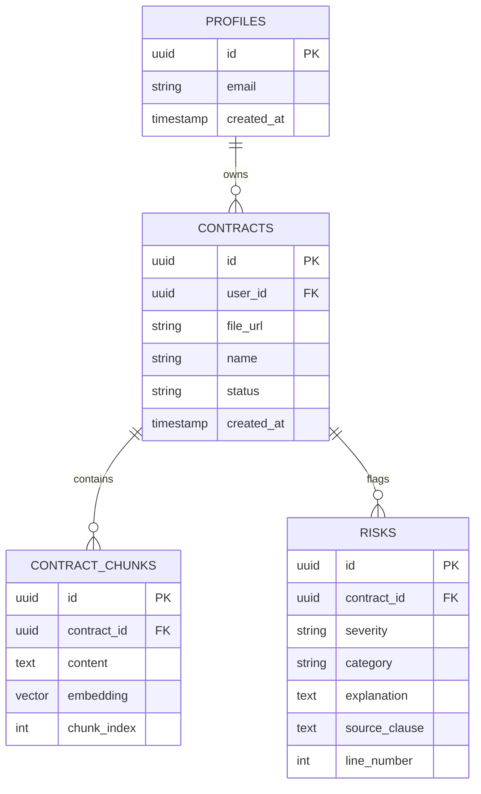

# Data Model & Database Schema

LegalLens AI uses **Supabase (PostgreSQL)** as its primary database. The database leverages the `pgvector` extension for storing and querying AI-generated text embeddings.

## 1. Entity-Relationship Diagram



## 2. Table Definitions

### `profiles`
Manages user metadata. Automatically synced with Supabase Auth via triggers.
- `id` (uuid, primary key): Matches `auth.users.id`.
- `email` (text): User email address.

### `contracts`
Stores metadata for uploaded PDF documents.
- `id` (uuid, primary key): Unique identifier.
- `user_id` (uuid, foreign key): References `profiles.id`.
- `file_url` (text): Public or signed URL to the PDF stored in Supabase Storage.
- `status` (text): State of processing (`pending`, `extracting`, `analyzed`, `error`).

### `contract_chunks`
Stores extracted raw text and its vector embedding for RAG.
- `id` (uuid, primary key).
- `contract_id` (uuid, foreign key): References `contracts.id`.
- `content` (text): Raw text chunk (approx. 500-1000 tokens).
- `embedding` (vector(768)): Google `text-embedding-004` output. Indexed using HNSW for fast similarity search.

### `risks`
Stores the structured output generated by the AI Agent.
- `id` (uuid, primary key).
- `contract_id` (uuid, foreign key).
- `severity` (text): `High`, `Medium`, or `Low`.
- `category` (text): e.g., `Penalty`, `Auto-renewal`, `Termination`.
- `explanation` (text): Plain English translation of the risk.
- `source_clause` (text): The verbatim exact string extracted from the document.

## 3. Row Level Security (RLS) Policies

To ensure multi-tenant data privacy, RLS is strictly enforced on all tables.

```sql
-- Example RLS Policy for 'contracts'
ALTER TABLE contracts ENABLE ROW LEVEL SECURITY;

CREATE POLICY "Users can only view their own contracts"
ON contracts FOR SELECT
USING (auth.uid() = user_id);

CREATE POLICY "Users can insert their own contracts"
ON contracts FOR INSERT
WITH CHECK (auth.uid() = user_id);
```
*(Similar policies are applied to `contract_chunks` and `risks` by joining against `contracts.user_id`)*
