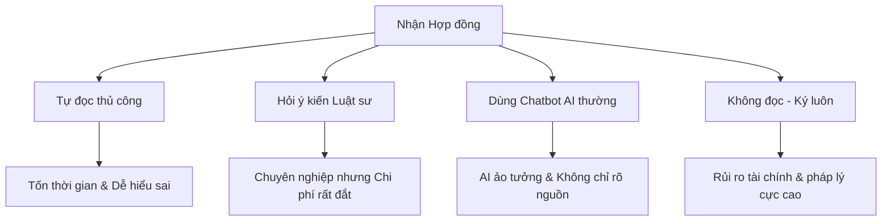

# PHÂN TÍCH SẢN PHẨM — LEGALLENS AI

> **[Mục tiêu phân tích]** Làm rõ bài toán thực tế, định vị đối tượng người dùng, đánh giá các giải pháp thay thế hiện tại và phân tích rủi ro sản phẩm để xây dựng một kế hoạch phát triển MVP tinh gọn nhất.

---

## 1. Tổng quan Sản phẩm (Product Overview)

**LegalLens AI** là nền tảng phân tích hợp đồng thông minh được xây dựng nhằm giúp người dùng phổ thông chủ động đọc hiểu và phát hiện các rủi ro pháp lý/tài chính tiềm ẩn trước khi thực hiện ký kết bất kỳ thỏa thuận nào.

```
       +------------------+     trích xuất     +------------------+
       |   Hợp đồng PDF   |  ================> | Văn bản dễ hiểu  |
       |  (Đọc khó khăn)  |                    | (Tóm tắt & Rủi ro|
       +------------------+                    +------------------+
                ||                                      ||
                \/                                      \/
       +------------------+                    +------------------+
       | AI rà soát lỗi   |  ================> | Tự tin đàm phán  |
       |  (Đối chiếu cọc) |                    |   hoặc ký kết    |
       +------------------+                    +------------------+
```

---

## 2. Phát biểu Vấn đề & Hệ quả (Problem Statement)

Hơn 90% người dùng phổ thông đồng ý ký hợp đồng thuê nhà, hợp đồng lao động hoặc điều khoản dịch vụ mạng xã hội mà không thực sự đọc hay hiểu rõ nội dung.

### Nguyên nhân cốt lõi:
* **Legalese (Ngôn ngữ pháp lý):** Văn phong học thuật, câu chữ lắt léo và khó hiểu đối với người không chuyên.
* **Thời gian & Độ dài:** Tài liệu quá dài (hàng chục trang) khiến người dùng nản lòng.
* **Thiếu kinh nghiệm pháp lý:** Người dùng không biết bản thân nên tập trung chú ý vào các điều khoản cụ thể nào để phòng ngừa rủi ro.

### Hệ quả thực tế:
* Mất tiền đặt cọc thuê nhà vô lý.
* Tự động gia hạn hợp đồng thuê phòng/dịch vụ ngoài tầm kiểm soát.
* Chịu phí phạt tài chính nặng khi chấm dứt hợp đồng sớm trước thời hạn thỏa thuận.
* Cho phép bên thứ ba thu thập và chia sẻ rộng rãi dữ liệu cá nhân nhạy cảm mà không biết.

---

## 3. Phân khúc Khách hàng Mục tiêu (Target Users)

| Nhóm người dùng | Trường hợp sử dụng tiêu biểu | Khó khăn lớn nhất (Pain Points) |
| :--- | :--- | :--- |
| **Sinh viên** | Hợp đồng thuê nhà/phòng trọ, Thỏa thuận học bổng, Hợp đồng thực tập | Thiếu kiến thức và kinh nghiệm pháp lý cuộc sống, Dễ bị chủ nhà chèn ép các điều khoản mất tiền đặt cọc |
| **Freelancer** | Hợp đồng cung cấp dịch vụ thiết kế/code, Cam kết sở hữu trí tuệ công việc | Rủi ro bị chậm trễ hoặc nợ tiền thanh toán, Mơ hồ về phạm vi bàn giao công việc (Scope creep) |
| **Người lao động** | Hợp đồng thử việc/hợp đồng lao động, Thỏa thuận bảo mật NDA | Rủi ro từ các điều khoản bảo mật quá khắt khe, Các cam kết không cạnh tranh (non-compete) bất hợp lý |
| **Người tiêu dùng** | Điều khoản sử dụng dịch vụ trực tuyến, Đăng ký gói thuê bao trả phí tháng | Văn bản quá dài, khó đọc hiểu trên thiết bị di động, Dễ bỏ qua điều khoản tự động gia hạn phát sinh chi phí |

---

## 4. Đánh giá các Giải pháp Thay thế (Alternatives)

Khi nhận được một hợp đồng, người dùng hiện tại thường có các lựa chọn sau:



> [!TIP]
> **LegalLens AI tạo ra lựa chọn thứ năm:** Phân tích nhanh chóng như AI thông dụng nhưng có trích dẫn đối chứng nguồn chặt chẽ để đảm bảo độ chính xác, với chi phí dễ tiếp cận đối với mọi đối tượng học sinh, sinh viên.

---

## 5. Định hình Phạm vi MVP (Minimum Viable Product)

### Các tính năng bao gồm trong MVP
1. **Tải lên PDF:** Người dùng kéo thả và tải tệp hợp đồng PDF cá nhân lên hệ thống dễ dàng.
2. **Trích xuất văn bản:** Xử lý và đọc nội dung văn bản thô từ tệp PDF hoạt động độc lập.
3. **Tóm tắt hợp đồng:** Rút gọn nội dung tài liệu thành một bản tóm tắt ngắn gọn dễ hiểu.
4. **Phát hiện rủi ro:** AI quét và nhận diện tự động các điều khoản phạt, gia hạn, mất tiền đặt cọc.
5. **Hỏi đáp grounded (QA):** Trò chuyện hỏi đáp trực tiếp dựa trên ngữ cảnh hợp đồng đã tải lên.
6. **Trích dẫn nguồn:** Mọi câu trả lời của AI đều hiển thị đường dẫn đối chiếu tới điều khoản gốc.

### Các tính năng ngoài phạm vi MVP (Out of Scope)
* Tư vấn hoặc đại diện pháp lý chuyên nghiệp.
* Soạn thảo mới hoặc chỉnh sửa trực tiếp nội dung hợp đồng.
* Dự đoán kết quả thắng/thua kiện trước tòa án.
* Chữ ký điện tử hoặc quản lý luồng công việc của doanh nghiệp (Enterprise workflow).

---

## 6. Phân tích Rủi ro Sản phẩm & Biện pháp Giảm thiểu

### Rủi ro Kỹ thuật
* **Xử lý tài liệu dung lượng lớn:** Các tệp PDF quá dài có thể làm tăng đáng kể thời gian phản hồi hoặc làm lỗi hệ thống.
  * *Biện pháp:* Giới hạn kích thước tệp tải lên (tối đa 10MB) và áp dụng chiến lược phân trang/phân mảnh dữ liệu (Text chunking) thông minh.
* **AI ảo tưởng kết quả (Hallucination):** AI trả lời sai thông tin hoặc suy diễn các điều khoản không tồn tại trong tài liệu gốc.
  * *Biện pháp:* Áp dụng công nghệ RAG (Tạo tăng cường truy xuất) kết hợp quy trình bắt buộc hiển thị trích dẫn nguồn và tô sáng văn bản gốc trên giao diện.
* **Chất lượng truy xuất kém:** Hệ thống RAG bỏ sót hoặc không tìm thấy các điều khoản rủi ro liên quan để cung cấp cho mô hình AI.
  * *Biện pháp:* Tối ưu hóa mô hình nhúng (Embedding model) và kiểm thử thủ công thường xuyên chất lượng tìm kiếm ngữ cảnh.

### Rủi ro Pháp lý & Kinh doanh
* **Người dùng coi kết quả của AI là lời khuyên pháp lý chính thức:** Có thể kiện dự án nếu họ ký hợp đồng và gặp rủi ro thực tế.
  * *Biện pháp:* Hiển thị thông báo tuyên bố miễn trừ trách nhiệm pháp lý nổi bật trên trang chủ, nhấn mạnh tính chất tham khảo giáo dục của hệ thống.

---

## 7. Chỉ số Thành công cho MVP (Success Metrics)

* **Tỷ lệ tải lên thành công:** Trên 95% tệp PDF hợp đồng chuẩn hóa được xử lý thành công.
* **Thời gian xử lý trung bình:** Quá trình trích xuất văn bản và phân tích rủi ro hoàn thành dưới 15 giây mỗi hợp đồng.
* **Mức độ chính xác QA:** Trên 90% câu trả lời trò chuyện từ AI khớp chính xác với nội dung hợp đồng thô (được kiểm chứng qua trích dẫn nguồn).
* **Mức độ hài lòng:** Người dùng cảm nhận rõ rệt sự tự tin và tiết kiệm thời gian đọc hiểu hợp đồng khi đánh giá hệ thống.
