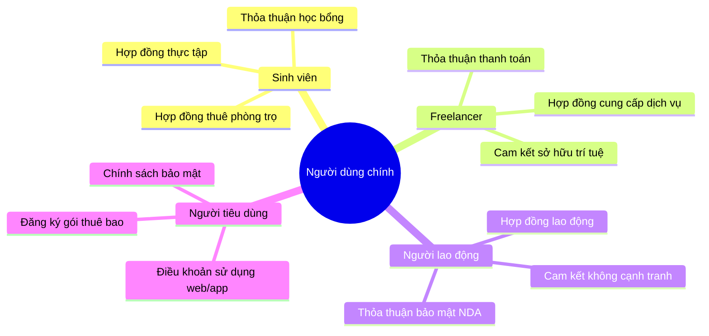
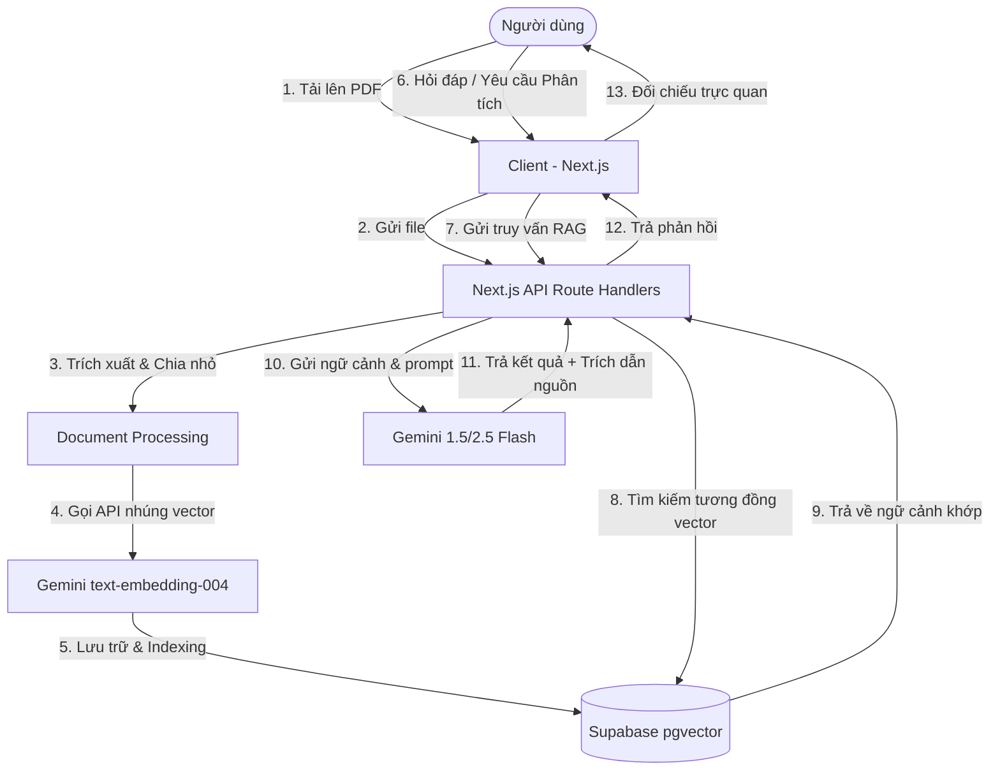
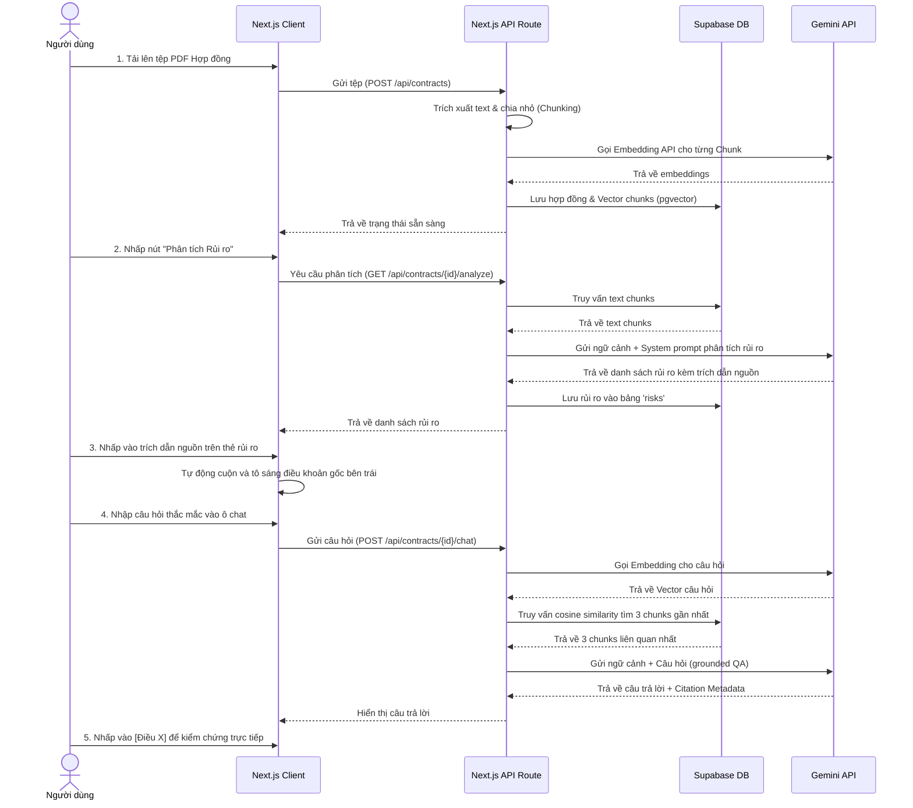

# ĐỊNH HƯỚNG SẢN PHẨM — LEGALLENS AI

> **[Sứ mệnh]** Giúp người dùng phổ thông thấu hiểu các rủi ro cốt lõi trong hợp đồng chỉ trong vòng **5 phút** thay vì hàng giờ đọc tài liệu khô khan.

---

## Tầm nhìn Sản phẩm (Product Vision)

LegalLens AI giúp người dùng phổ thông hiểu rõ hợp đồng trước khi đặt bút ký bằng cách đơn giản hóa quá trình xem xét, điều hướng và phân tích các văn bản pháp lý phức tạp.

Nền tảng thu hẹp khoảng cách thông tin bất đối xứng giữa bên soạn thảo hợp đồng và bên ký hợp đồng, giúp người dùng tự tin đưa ra các quyết định sáng suốt mà không đòi hỏi phải có chuyên môn sâu về pháp lý.

> [!IMPORTANT]
> **Tuyên bố miễn trừ:** Hệ thống chỉ cung cấp thông tin tham khảo và hỗ trợ giáo dục. Đây không phải là dịch vụ tư vấn pháp lý chuyên nghiệp và không thay thế vai trò của luật sư.

---

## Vấn đề thực tế (Problem Statement)

Mọi người thường xuyên ký kết các thỏa thuận dân sự hoặc thương mại mà không thực sự hiểu rõ những gì mình đã đồng ý do:
1. **Thuật ngữ phức tạp (Legalese):** Ngôn ngữ pháp lý lắt léo, xa lạ đối với người không chuyên.
2. **Độ dài tài liệu lớn:** Hợp đồng thường dài hàng chục trang, gây nản lòng khi tự đọc.
3. **Cạm bẫy ẩn giấu:** Các điều khoản bất lợi thường bị che giấu tinh vi bên trong các chương mục lớn.

Điều này dẫn đến các rủi ro thực tế:
* Phát sinh các khoản phí phạt tài chính ngoài ý muốn.
* Tự động gia hạn hợp đồng ngoài tầm kiểm soát.
* Mất tiền đặt cọc bất hợp lý.
* Cho phép chia sẻ rộng rãi dữ liệu cá nhân nhạy cảm.

---

## Khách hàng Mục tiêu (Target Personas)

---

## Nguyên tắc Thiết kế Sản phẩm (Product Principles)

* **Rõ ràng trước Phức tạp (Clarity Over Complexity):** Dịch thuật ngữ pháp lý khó hiểu thành ngôn ngữ phổ thông dễ hiểu cho mọi người dùng.
* **Bằng chứng trước Nhận định (Evidence Over Opinion):** AI chỉ phân tích dựa trên văn bản gốc trong tài liệu, không tự suy diễn vô căn cứ.
* **Tin cậy qua Minh bạch (Trust Through Transparency):** Mọi cảnh báo rủi ro đều phải hiển thị liên kết trích dẫn điều khoản gốc trực tiếp để đối chứng.
* **Thông tin có khả năng Hành động (Actionable Insights):** Không chỉ tóm tắt mà phải chỉ rõ nghĩa vụ, hạn chót, chi phí phạt và rủi ro trực diện.

---

## Kiến trúc Luồng Dữ liệu (RAG Architecture)

Dưới đây là mô hình xử lý thông tin từ khi người dùng tải tài liệu lên cho tới khi nhận được phản hồi phân tích từ AI:

---

## Bản đồ Tính năng & Phân loại Ưu tiên (Feature Roadmap)

| Độ ưu tiên | Tên tính năng | Mô tả chi tiết | Tích hợp AI |
| :--- | :--- | :--- | :---: |
| **P0 (Critical)** | **Tải lên PDF** | Cho phép người dùng kéo thả file PDF hợp đồng cá nhân | Không |
| **P0 (Critical)** | **Xử lý tài liệu** | Trích xuất văn bản thô từ tệp PDF và phân mảnh dữ liệu | Không |
| **P0 (Critical)** | **Tóm tắt hợp đồng** | Tạo bản tóm tắt nội dung cốt lõi của hợp đồng trong 1 trang | Có |
| **P0 (Critical)** | **Phát hiện rủi ro** | Nhận diện điều khoản phạt, gia hạn, mất cọc, quyền riêng tư | Có |
| **P0 (Critical)** | **Hỏi đáp RAG** | Chat hỏi đáp trực tiếp dựa trên nội dung hợp đồng gốc | Có |
| **P1 (Important)**| **Tô sáng điều khoản** | Tự động cuộn và làm nổi bật dòng văn bản gốc khi bấm rủi ro | Không |
| **P1 (Important)**| **Phân loại rủi ro** | Nhóm rủi ro theo danh mục: Tài chính, Gia hạn, Riêng tư... | Có |
| **P1 (Important)**| **Xuất báo cáo** | Cho phép tải báo cáo đánh giá rủi ro dạng PDF/Word | Không |
| **P2 (Optional)** | **So sánh hợp đồng** | Đặt 2 hợp đồng cạnh nhau để đối chiếu điều khoản | Có |
| **P2 (Optional)** | **Lịch sử phân tích** | Lưu trữ và hiển thị lại các hợp đồng đã phân tích trước đó | Không |

---

## Hành trình Trải nghiệm Người dùng (User Journey)

---

## Chỉ số Đo lường & Điều kiện Nghiệm thu

### Chỉ số Thành công (Success Metrics)
* **Thời gian thấu hiểu:** Người dùng nhận diện toàn bộ rủi ro chính trong hợp đồng mới dưới **5 phút**.
* **Độ tin cậy:** 100% các câu trả lời/cảnh báo rủi ro có hiển thị trích dẫn trực tiếp tới điều khoản tương ứng trong tài liệu gốc.
* **Trải nghiệm sử dụng:** Tỷ lệ người dùng tải lên hợp đồng và hoàn thành quá trình phân tích đạt trên 90%.

### Điều kiện Thất bại (Failure Conditions)
* Người dùng không thể hiểu các giải thích do AI đưa ra (quá nhiều từ ngữ chuyên môn, tối nghĩa).
* AI sinh ra các câu trả lời bị ảo tưởng (hallucination), không khớp với tài liệu gốc.
* Giao diện bị mất tính trực quan, hoạt động giống như một chatbot hỏi đáp thông thường thay vì một không gian làm việc chia đôi (workspace).
* Tốc độ phản hồi phân tích vượt quá 30 giây gây mất kiên nhẫn.
