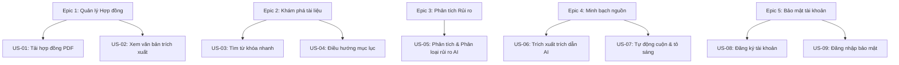

# YÊU CẦU DỰ ÁN & MÔ TẢ USER STORIES (OFFICIAL)

Tài liệu này xác định toàn bộ yêu cầu nghiệp vụ, kiến trúc tính năng và kịch bản nghiệm thu (Acceptance Criteria) cho dự án **LegalLens AI**.

---

## 1. Bản đồ liên kết tính năng (Epics & User Stories Mapping)

Dưới đây là sơ đồ mô tả cách phân nhóm các Câu chuyện người dùng (User Stories) vào các Nhóm tính năng lớn (Epics):

---

## 2. Kế hoạch phát triển MVP & Post-MVP (Sprint Backlog)

| ID | Câu chuyện người dùng (User Story) | Epic | Độ ưu tiên | Story Points (SP) | Kế hoạch Sprint | Tích hợp AI |
| :--- | :--- | :--- | :---: | :---: | :---: | :---: |
| **US-01** | Tải lên tài liệu hợp đồng | Epic 1 | Must Have (P1) | 3 | Sprint 1 (Tuần 6) | Không |
| **US-02** | Xem nội dung hợp đồng | Epic 1 | Must Have (P1) | 3 | Sprint 1 (Tuần 6) | Không |
| **US-03** | Tìm từ khóa nhanh | Epic 2 | Should Have (P2) | 3 | Sprint 3 (Tuần 8-9) | Không |
| **US-04** | Điều hướng mục lục | Epic 2 | Should Have (P2) | 2 | Sprint 3 (Tuần 8-9) | Không |
| **US-05** | Phân tích và phân loại mức độ rủi ro bằng AI | Epic 3 | Must Have (P1) | 8 | Sprint 2 (Tuần 7) | **Có** |
| **US-06** | Trích xuất trích dẫn nguồn làm bằng chứng cho rủi ro | Epic 4 | Must Have (P1) | 3 | Sprint 2 (Tuần 7) | **Có** |
| **US-07** | Tự động cuộn và tô sáng văn bản gốc | Epic 4 | Must Have (P1) | 3 | Sprint 2 (Tuần 7) | Không |
| **US-08** | Đăng ký tài khoản mới | Epic 5 | Could Have (P3) | 3 | Sprint 3 (Tuần 8-9) | Không |
| **US-09** | Đăng nhập hệ thống bảo mật | Epic 5 | Could Have (P3) | 3 | Sprint 3 (Tuần 8-9) | Không |

---

## 3. Các Kịch bản Sử dụng Thực tế (Use Case Scenarios)

### Kịch bản 1: Sinh viên thuê phòng trọ rà soát điều khoản đặt cọc
* **Tác nhân:** Minh Nguyễn (Sinh viên Bách Khoa).
* **Mục tiêu:** Kiểm tra xem điều kiện để nhận lại tiền đặt cọc có quá khắt khe hay chủ nhà có cài cắm điều khoản phạt chấm dứt hợp đồng sớm quá mức hợp lý không.
* **Hành trình:** Minh tải file scan hợp đồng thuê nhà PDF lên ứng dụng -> Bấm nút phân tích rủi ro -> AI báo có 2 rủi ro Cao (Điều khoản tịch thu 100% tiền đặt cọc khi chấm dứt sớm, phạt đền bù thêm 1 tháng tiền phòng) -> Minh bấm xem trích dẫn nguồn để kiểm chứng -> Hệ thống cuộn và tô sáng Điều 2.2 và Điều 8.4 -> Minh đàm phán lại với chủ nhà yêu cầu sửa đổi điều kiện báo trước 30 ngày để nhận lại cọc.

### Kịch bản 2: Freelancer kiểm tra điều khoản nghiệm thu & thanh toán
* **Tác nhân:** Linh Trần (Freelancer Designer).
* **Mục tiêu:** Xác định rõ thời hạn khách hàng phê duyệt sản phẩm thiết kế và quy trình giải ngân thanh toán sau khi hoàn tất các mốc tiến độ (milestones).
* **Hành trình:** Linh tải hợp đồng dịch vụ thiết kế lên -> Đọc tóm tắt và xem bảng điều khiển rủi ro -> AI phát hiện rủi ro Trung bình (Khách hàng có quyền đơn phương thay đổi tiến độ hoặc yêu cầu sửa đổi không giới hạn số lần) -> Linh trò chuyện với AI hỏi "Khách hàng trả tiền chậm phạt thế nào?" -> AI báo không tìm thấy điều khoản phạt trả chậm trong hợp đồng gốc -> Linh sửa đổi bổ sung điều khoản này vào hợp đồng trước khi ký.

### Kịch bản 3: Nhân viên mới đi làm rà soát thỏa thuận NDA & Không cạnh tranh
* **Tác nhân:** Huy Phạm (Nhân viên mới ra trường).
* **Mục tiêu:** Hiểu rõ giới hạn địa lý và thời gian của điều khoản không cạnh tranh (Non-compete) sau khi chấm dứt hợp đồng.
* **Hành trình:** Huy tải hợp đồng lao động lên -> AI phát hiện rủi ro Cao ở Thỏa thuận bảo mật và hạn chế cạnh tranh (Cấm làm việc cho đối thủ cạnh tranh trong vòng 2 năm trên toàn lãnh thổ Việt Nam) -> Hệ thống tự động tô sáng Điều 12.3 -> Huy nhận ra điều khoản này quá rộng và không hợp lý đối với vị trí fresher của mình -> Huy đàm phán thu hẹp phạm vi địa lý xuống chỉ trong khu vực TP.HCM.

---

## 4. Mô tả chi tiết các Câu chuyện người dùng (User Stories)

### Epic 1: Quản lý Hợp đồng (Contract Management)

#### US-01: Tải lên tài liệu hợp đồng
* **Mô tả:** Là một người dùng, tôi muốn dễ dàng kéo thả hoặc tải tệp PDF hợp đồng cá nhân lên hệ thống, để hệ thống xử lý nội dung văn bản.
* **Độ ưu tiên:** Must Have (P1)
* **Độ phức tạp:** 3 SP
* **AI tham gia:** Không
* **Tiêu chuẩn nghiệm thu (BDD):**
  * **Given:** Người dùng ở trang chủ tải lên.
  * **When:** Chọn một tệp hợp đồng định dạng PDF hợp lệ (dung lượng dưới 10MB).
  * **Then:** Hệ thống tải tệp thành công và hiển thị tiến trình trích xuất văn bản thô.

#### US-02: Xem nội dung hợp đồng
* **Mô tả:** Là một người dùng, tôi muốn xem văn bản thô đã trích xuất từ tệp PDF trực quan trên giao diện ứng dụng, để tôi tự rà soát nội dung.
* **Độ ưu tiên:** Must Have (P1)
* **Độ phức tạp:** 3 SP
* **AI tham gia:** Không
* **Tiêu chuẩn nghiệm thu (BDD):**
  * **Given:** Hệ thống hoàn thành trích xuất tệp hợp đồng.
  * **When:** Người dùng chuyển hướng tới màn hình chính Workspace.
  * **Then:** Văn bản gốc của hợp đồng hiển thị đầy đủ ở phân khu bên trái (Contract Viewer), giữ nguyên định dạng xuống dòng cơ bản.

---

### Epic 2: Khám phá tài liệu (Document Exploration)

#### US-03: Tìm từ khóa nhanh
* **Mô tả:** Là một người dùng, tôi muốn nhập từ khóa để tìm kiếm nhanh các vị trí xuất hiện trong hợp đồng, giúp tôi định vị nhanh thông tin cần quan tâm.
* **Độ ưu tiên:** Should Have (P2)
* **Độ phức tạp:** 3 SP
* **AI tham gia:** Không
* **Tiêu chuẩn nghiệm thu (BDD):**
  * **Given:** Người dùng đang xem tài liệu hợp đồng tại Contract Viewer.
  * **When:** Người dùng nhập một cụm từ (ví dụ: "đặt cọc") vào ô tìm kiếm nhanh.
  * **Then:** Hệ thống làm nổi bật tất cả các vị trí trùng khớp trong văn bản và hiển thị số lượng kết quả (ví dụ: 1/5). Người dùng có thể bấm phím điều hướng để nhảy nhanh giữa các từ khóa đó.

#### US-04: Điều hướng mục lục
* **Mô tả:** Là một người dùng, tôi muốn có một thanh điều hướng mục lục tự động phân tách theo các Điều/Khoản lớn, để tôi dễ dàng di chuyển trong tài liệu dài.
* **Độ ưu tiên:** Should Have (P2)
* **Độ phức tạp:** 2 SP
* **AI tham gia:** Không
* **Tiêu chuẩn nghiệm thu (BDD):**
  * **Given:** Hệ thống phân tách cấu trúc hợp đồng thành công.
  * **When:** Người dùng nhấp vào một tiêu đề trên sidebar mục lục (ví dụ: "Điều 5: Thanh toán").
  * **Then:** Trình xem hợp đồng bên trái lập tức cuộn mượt đến tiêu đề đó và làm nhấp nháy dòng tiêu đề trong 2 giây để gây sự chú ý.

---

### Epic 3: Phân tích Rủi ro tự động (Risk Analysis)

#### US-05: Phân tích và phân loại mức độ rủi ro bằng AI
* **Mô tả:** Là một người dùng, tôi muốn hệ thống tự động quét, phân tích và phân loại các điều khoản rủi ro tiềm ẩn nguy hiểm theo mức độ nghiêm trọng (Cao, Trung bình, Thấp), giúp tôi dễ dàng tập trung sự chú ý vào các phần quan trọng nhất.
* **Độ ưu tiên:** Must Have (P1)
* **Độ phức tạp:** 8 SP
* **AI tham gia:** **Có**
* **Tiêu chuẩn nghiệm thu (BDD):**
  * **Given:** Văn bản hợp đồng thô đã được trích xuất hoàn tất.
  * **When:** Người dùng nhấp vào nút "Analyze Risks".
  * **Then:** Hệ thống gửi dữ liệu đến RAG pipeline và hiển thị danh sách các cảnh báo rủi ro được phát hiện ở phân khu bên phải, được dịch nghĩa rõ ràng sang ngôn ngữ phổ thông và phân loại màu sắc trực quan: Cao (Đỏ), Trung bình (Vàng), Thấp (Xanh) kèm theo bộ lọc danh mục giúp người dùng lọc nhanh theo mức độ.

---

### Epic 4: Bằng chứng & Sự Minh bạch (Evidence & Transparency)

#### US-06: Trích xuất trích dẫn nguồn làm bằng chứng cho rủi ro
* **Mô tả:** Là một người dùng, tôi muốn mỗi cảnh báo rủi ro do AI sinh ra đều đi kèm thông tin chỉ định rõ đoạn văn bản gốc làm căn cứ để tôi kiểm chứng tính trung thực.
* **Độ ưu tiên:** Must Have (P1)
* **Độ phức tạp:** 3 SP
* **AI tham gia:** **Có**
* **Tiêu chuẩn nghiệm thu (BDD):**
  * **Given:** AI phát hiện ra một rủi ro cụ thể trong hợp đồng.
  * **When:** Hệ thống hiển thị thẻ cảnh báo rủi ro đó.
  * **Then:** Thẻ cảnh báo phải hiển thị đoạn văn bản gốc (Excerpt) làm bằng chứng kiểm chứng trực tiếp và ghi rõ số hiệu Điều/Khoản làm căn cứ.

#### US-07: Tự động cuộn và tô sáng văn bản gốc
* **Mô tả:** Là một người dùng, tôi muốn nhấp vào nguồn trích dẫn của rủi ro và hệ thống tự động đưa tôi đến vị trí điều khoản đó trong văn bản gốc và đánh dấu nổi bật nó.
* **Độ ưu tiên:** Must Have (P1)
* **Độ phức tạp:** 3 SP
* **AI tham gia:** Không
* **Tiêu chuẩn nghiệm thu (BDD):**
  * **Given:** Người dùng đang xem danh sách rủi ro ở bên phải và văn bản hợp đồng ở bên trái.
  * **When:** Người dùng nhấp vào liên kết nguồn "Điều X.Y" hoặc nút "Xem tại nguồn gốc" trên thẻ rủi ro.
  * **Then:** Trình xem hợp đồng bên trái tự động cuộn (smooth scroll) đến đoạn văn bản đó và tô sáng (highlight) bằng màu sắc tương ứng với mức độ nghiêm trọng của rủi ro (Đỏ nhạt, Vàng nhạt, Xanh nhạt).

---

### Epic 5: Bảo mật tài khoản (Account Security)

#### US-08: Đăng ký tài khoản mới
* **Mô tả:** Là một người dùng mới, tôi muốn đăng ký một tài khoản an toàn để lưu trữ lịch sử phân tích hợp đồng của cá nhân.
* **Độ ưu tiên:** Could Have (P3)
* **Độ phức tạp:** 3 SP
* **AI tham gia:** Không
* **Tiêu chuẩn nghiệm thu (BDD):**
  * **Given:** Người dùng chưa đăng nhập và đang mở form Đăng ký.
  * **When:** Nhập thông tin Email hợp lệ, Mật khẩu đạt chuẩn bảo mật (ít nhất 8 ký tự, có số, chữ hoa, ký tự đặc biệt) và bấm nút "Đăng ký".
  * **Then:** Hệ thống gửi email xác minh và hiển thị thông báo yêu cầu người dùng kích hoạt tài khoản.

#### US-09: Đăng nhập hệ thống bảo mật
* **Mô tả:** Là một người dùng đã có tài khoản, tôi muốn đăng nhập bảo mật vào hệ thống để truy cập workspace cá nhân.
* **Độ ưu tiên:** Could Have (P3)
* **Độ phức tạp:** 3 SP
* **AI tham gia:** Không
* **Tiêu chuẩn nghiệm thu (BDD):**
  * **Given:** Người dùng ở trang đăng nhập.
  * **When:** Điền đúng tài khoản/mật khẩu và click "Đăng nhập".
  * **Then:** Hệ thống xác thực thông tin, cấp mã Token JWT an toàn và chuyển hướng người dùng đến Workspace cá nhân với đầy đủ lịch sử các hợp đồng cũ.
