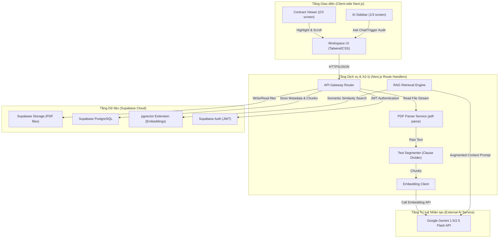
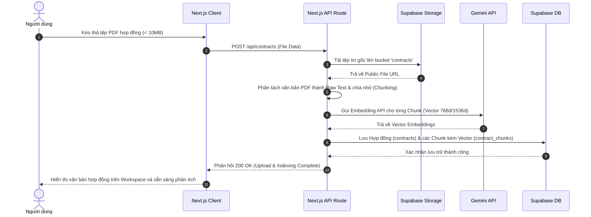
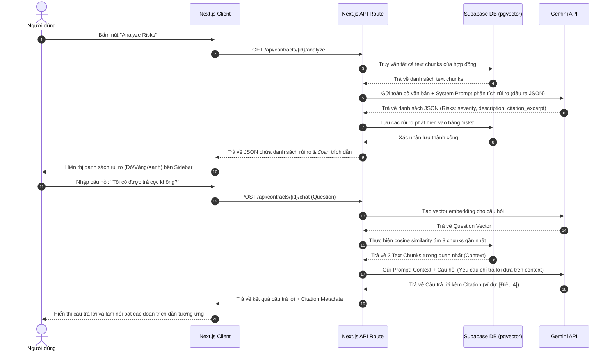

# KIẾN TRÚC HỆ THỐNG - LEGALLENS AI

Tài liệu này mô tả chi tiết thiết kế kiến trúc hệ thống của **LegalLens AI**, xác định các thành phần phần mềm, cơ chế tương tác và các luồng nghiệp vụ cốt lõi để hiện thực hóa sản phẩm MVP.

---

## 1. Sơ đồ Kiến trúc Tổng quan (System Component Architecture)

Hệ thống được thiết kế theo mô hình kiến trúc **Monolith cải tiến** sử dụng Next.js (chứa cả Giao diện Frontend và API Route Handlers phía Backend). Cách tiếp cận này giúp tối giản hóa hạ tầng, dễ triển khai trên Vercel và tránh việc phân chia dịch vụ quá sớm (YAGNI).

Dưới đây là sơ đồ các thành phần hệ thống và các tầng tương tác:

---

## 2. Các Luồng Nghiệp vụ Chính (Sequence Diagrams)

### 2.1 Luồng Tải lên và Xử lý tài liệu (Contract Upload & Indexing Flow)

Luồng này bắt đầu khi người dùng kéo thả hợp đồng dạng PDF lên giao diện và kết thúc khi tài liệu được lưu trữ, trích xuất và lưu vào Vector Store sẵn sàng cho việc phân tích rủi ro.

### 2.2 Luồng Phân tích Rủi ro và Hỏi đáp Grounded (AI Risk Analysis & Q&A Flow)

Luồng này mô tả cách hệ thống lấy dữ liệu văn bản từ Database, tạo ngữ cảnh an toàn gửi tới Gemini và nhận về phản hồi chính xác giúp người dùng kiểm chứng.

---

## 3. Lý do Lựa chọn Công nghệ (Architectural Decisions)

* **Next.js App Router (Single Deployment Unit):**
  * *Lý do:* Cho phép gộp cả Frontend và Backend API vào một project duy nhất. Giúp tăng tốc độ phát triển và giảm thiểu overhead khi deploy (chỉ cần đẩy lên Vercel).
  * *Hỗ trợ:* API Route Handlers chạy trên Node.js dễ dàng import các thư viện xử lý PDF và gọi API ngoài.
* **Supabase pgvector:**
  * *Lý do:* Tránh việc phải quản lý riêng biệt một cơ sở dữ liệu Vector độc lập (như Pinecone hay Milvus). Supabase cung cấp PostgreSQL mạnh mẽ kết hợp pgvector cho phép thực hiện truy vấn quan hệ thông thường và tìm kiếm tương đồng vector bằng SQL trên cùng một database.
* **Gemini 1.5/2.5 Flash:**
  * *Lý do:* Tốc độ phản hồi cực nhanh (phù hợp với các ứng dụng interactive chat và stream response), hỗ trợ context window lớn để đọc toàn bộ hợp đồng trực tiếp, và chi phí gọi API cực kỳ tối ưu cho môi trường giáo dục/học tập nhóm.
