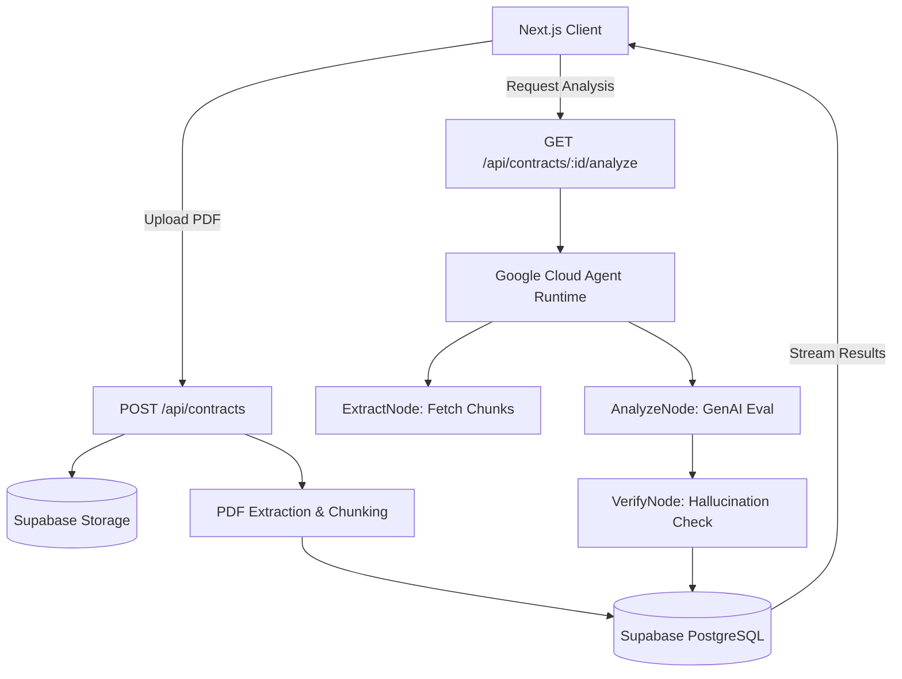

# System Architecture

LegalLens AI employs a modern, serverless architecture that tightly integrates frontend UI, backend API routing, database management, and intelligent Agent execution. 

## 1. High-Level Architecture Diagram

## 2. Core Components

### 2.1 Next.js Frontend
- **Framework:** Next.js (App Router), React, TailwindCSS.
- **Responsibility:** Handles user authentication (Supabase Auth), file dropzone (`react-dropzone`), and renders the Contract Viewer.
- **Real-time UX:** Listens to Server-Sent Events (SSE) or polling to display real-time Agent thought processes (e.g., "Agent is scanning for penalty clauses..."). Clicking a detected risk triggers a scroll-and-highlight action in the document viewer.

### 2.2 Next.js API Routes (Backend)
- **Responsibility:** Acts as the secure middleware between the Client and the Database/Agent Runtime.
- **Key Routes:**
  - `POST /api/contracts`: Validates PDF, uploads to Supabase Storage, triggers text extraction, splits text into 500-1000 token chunks, generates vector embeddings (`text-embedding-004`), and stores them in Supabase.
  - `GET /api/contracts/[id]/analyze`: Invokes the remote Google Cloud Agent Runtime to begin the legal analysis.

### 2.3 Agentic State Graph (Google ADK)
The intelligence of LegalLens AI is structured as a deterministic State Graph using the Google GenAI SDK.

- **`ExtractNode`**: Retrieves the vectorized text chunks of the specific contract from Supabase.
- **`AnalyzeNode`**: Injects custom heuristics from `SKILL.md` (Antigravity). It uses `gemini-1.5-flash` to evaluate the chunks against known predatory patterns (auto-renewals, heavy penalties). Output is enforced as Structured JSON.
- **`VerifyNode (Evaluator)`**: An anti-hallucination guardrail. It cross-references the `source_clause` exact string returned by `AnalyzeNode` against the raw document chunks. If a 100% exact match fails, the risk object is discarded. Only verified risks are written back to Supabase.

### 2.4 Database (Supabase)
- **PostgreSQL + pgvector:** Stores relational data and vector embeddings for RAG (Retrieval-Augmented Generation).
- **Row Level Security (RLS):** Ensures strict multi-tenant data isolation. All queries strictly enforce `auth.uid()`.
