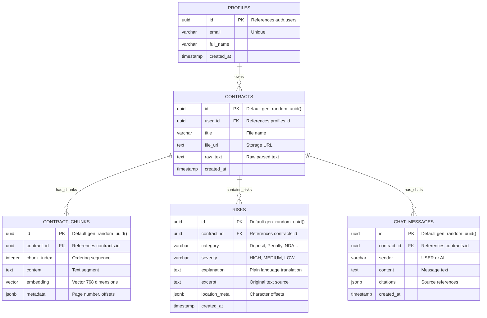

# THIẾT KẾ MÔ HÌNH DỮ LIỆU - LEGALLENS AI

Tài liệu này đặc tả thiết kế Cơ sở Dữ liệu Quan hệ (Relational DB Schema) và thiết kế Vector Store phục vụ cho việc tìm kiếm ngữ cảnh RAG trong hệ thống **LegalLens AI**.

---

## 1. Sơ đồ Thực thể Quan hệ (Entity-Relationship Diagram)

Dưới đây là sơ đồ ER biểu diễn mối quan hệ giữa các thực thể cốt lõi trong hệ thống:



---

## 2. Đặc tả Chi tiết các Bảng (Database Schema DDL)

Dưới đây là mã SQL DDL để khởi tạo các bảng và các mối quan hệ trên Supabase PostgreSQL.

### 2.1 Kích hoạt extension pgvector
```sql
-- Kích hoạt extension pgvector trên PostgreSQL của Supabase
CREATE EXTENSION IF NOT EXISTS vector;
```

### 2.2 Bảng: `profiles` (Đồng bộ từ auth.users)
```sql
CREATE TABLE public.profiles (
    id UUID REFERENCES auth.users(id) ON DELETE CASCADE PRIMARY KEY,
    email VARCHAR(255) UNIQUE NOT NULL,
    full_name VARCHAR(255),
    created_at TIMESTAMP WITH TIME ZONE DEFAULT timezone('utc'::text, now()) NOT NULL
);

-- Kích hoạt Row Level Security (RLS) để bảo vệ thông tin cá nhân
ALTER TABLE public.profiles ENABLE ROW LEVEL SECURITY;
```

### 2.3 Bảng: `contracts`
```sql
CREATE TABLE public.contracts (
    id UUID PRIMARY KEY DEFAULT gen_random_uuid(),
    user_id UUID REFERENCES public.profiles(id) ON DELETE CASCADE NOT NULL,
    title VARCHAR(255) NOT NULL,
    file_url TEXT NOT NULL,
    raw_text TEXT NOT NULL,
    created_at TIMESTAMP WITH TIME ZONE DEFAULT timezone('utc'::text, now()) NOT NULL
);

ALTER TABLE public.contracts ENABLE ROW LEVEL SECURITY;

-- Chính sách bảo mật RLS: Chỉ chủ sở hữu mới có quyền đọc/ghi hợp đồng của họ
CREATE POLICY "Users can manage their own contracts" 
ON public.contracts 
FOR ALL 
USING (auth.uid() = user_id);
```

### 2.4 Bảng: `contract_chunks` (Vector Store)
Bảng này lưu trữ các phân đoạn văn bản của hợp đồng phục vụ cho truy vấn RAG. Chiều dài vector là **768** (Tương thích với Gemini Embedding API - model `text-embedding-004`).
```sql
CREATE TABLE public.contract_chunks (
    id UUID PRIMARY KEY DEFAULT gen_random_uuid(),
    contract_id UUID REFERENCES public.contracts(id) ON DELETE CASCADE NOT NULL,
    chunk_index INTEGER NOT NULL,
    content TEXT NOT NULL,
    embedding VECTOR(768) NOT NULL, -- Vector 768d của Gemini text-embedding-004
    metadata JSONB DEFAULT '{}'::jsonb NOT NULL
);

ALTER TABLE public.contract_chunks ENABLE ROW LEVEL SECURITY;

-- RLS: Người dùng được quyền đọc chunks của hợp đồng mà họ sở hữu
CREATE POLICY "Users can read chunks of their contracts" 
ON public.contract_chunks 
FOR SELECT 
USING (
    contract_id IN (
        SELECT id FROM public.contracts WHERE user_id = auth.uid()
    )
);
```

### 2.5 Bảng: `risks`
```sql
CREATE TABLE public.risks (
    id UUID PRIMARY KEY DEFAULT gen_random_uuid(),
    contract_id UUID REFERENCES public.contracts(id) ON DELETE CASCADE NOT NULL,
    category VARCHAR(100) NOT NULL,
    severity VARCHAR(20) CHECK (severity IN ('HIGH', 'MEDIUM', 'LOW')) NOT NULL,
    explanation TEXT NOT NULL,
    excerpt TEXT NOT NULL,
    location_meta JSONB DEFAULT '{}'::jsonb NOT NULL,
    created_at TIMESTAMP WITH TIME ZONE DEFAULT timezone('utc'::text, now()) NOT NULL
);

ALTER TABLE public.risks ENABLE ROW LEVEL SECURITY;

CREATE POLICY "Users can manage risks of their contracts" 
ON public.risks 
FOR ALL 
USING (
    contract_id IN (
        SELECT id FROM public.contracts WHERE user_id = auth.uid()
    )
);
```

### 2.6 Bảng: `chat_messages`
```sql
CREATE TABLE public.chat_messages (
    id UUID PRIMARY KEY DEFAULT gen_random_uuid(),
    contract_id UUID REFERENCES public.contracts(id) ON DELETE CASCADE NOT NULL,
    sender VARCHAR(10) CHECK (sender IN ('USER', 'AI')) NOT NULL,
    content TEXT NOT NULL,
    citations JSONB DEFAULT '[]'::jsonb NOT NULL,
    created_at TIMESTAMP WITH TIME ZONE DEFAULT timezone('utc'::text, now()) NOT NULL
);

ALTER TABLE public.chat_messages ENABLE ROW LEVEL SECURITY;

CREATE POLICY "Users can manage chat messages of their contracts" 
ON public.chat_messages 
FOR ALL 
USING (
    contract_id IN (
        SELECT id FROM public.contracts WHERE user_id = auth.uid()
    )
);
```

---

## 3. Hàm Truy vấn Tương đồng Vector (Similarity Search Helper)

Để thực hiện tìm kiếm ngữ cảnh dựa trên độ tương đồng Cosine (Cosine Similarity), chúng ta tạo một hàm lưu trữ (Stored Procedure) trong Postgres:

```sql
CREATE OR REPLACE FUNCTION match_contract_chunks (
  query_embedding VECTOR(768),
  match_threshold FLOAT,
  match_count INT,
  filter_contract_id UUID
)
RETURNS TABLE (
  id UUID,
  content TEXT,
  similarity FLOAT
)
LANGUAGE plpgsql
AS $$
BEGIN
  RETURN QUERY
  SELECT
    contract_chunks.id,
    contract_chunks.content,
    1 - (contract_chunks.embedding <=> query_embedding) AS similarity -- Cosine Similarity
  FROM contract_chunks
  WHERE contract_chunks.contract_id = filter_contract_id
    AND 1 - (contract_chunks.embedding <=> query_embedding) > match_threshold
  ORDER BY contract_chunks.embedding <=> query_embedding ASC
  LIMIT match_count;
END;
$$;
```

---

## 4. Giải thích Tối ưu hóa Database

* **Hạn chế Chỉ mục (pgvector):** Vì số lượng chunk của một hợp đồng trung bình rất nhỏ (từ 50 đến 300 chunks cho hợp đồng 10-30 trang), việc tạo các index như HNSW hay IVFFlat là không cần thiết (YAGNI). Hệ thống có thể thực hiện so sánh chính xác trực tiếp (Flat Search) trong phạm vi `contract_id` cụ thể với tốc độ tính bằng phần nghìn giây (millisecond).
* **Location Metadata:** Cấu trúc `location_meta` trong bảng `risks` lưu trữ vị trí trích dẫn của rủi ro dưới dạng:
  ```json
  {
    "page": 3,
    "start_char": 1420,
    "end_char": 1545,
    "matching_text": "Tiền đặt cọc sẽ không được hoàn trả dưới bất kỳ hình thức nào nếu Bên B chấm dứt trước hạn..."
  }
  ```
  Giúp frontend dễ dàng so khớp và tô sáng dòng chữ gốc chính xác trong giao diện.
